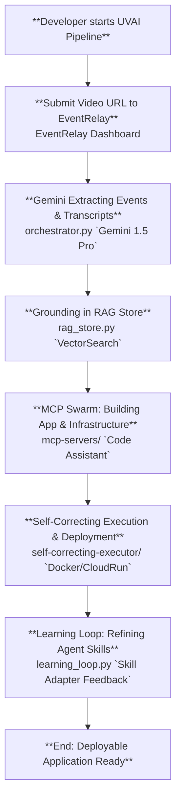

# Unnamed CodeViz Diagram



# Unnamed CodeViz Diagram

```mermaid
graph TD

    base.cv::netmesh_prod["**NetMesh Production App**<br>netmesh-production/index.html `UVAI`, netmesh-production/package.json `name`"]
    base.cv::netmesh_ext["**NetMesh Browser Extension**<br>netmesh-extension/manifest.json `name`, netmesh-extension/background.js `chrome.sidePanel`"]
    base.cv::sce_prod["**Self-Correcting Executor (Production)**<br>self-correcting-executor-PRODUCTION/Dockerfile `FROM python`, self-correcting-executor-PRODUCTION/main.py `if __name__ == "__main__":`"]
    base.cv::solitary_bread["**Solitary Bread BBCC Worker**<br>solitary-bread-bbcc/wrangler.jsonc `name`, solitary-bread-bbcc/Dockerfile `FROM node`"]
    base.cv::falling_union["**Falling Union BCED Worker**<br>falling-union-bced/wrangler.jsonc `name`"]
    base.cv::universal_automation["**Universal Automation Service**<br>universal-automation-service/Dockerfile `FROM`"]
    base.cv::user["**User**<br>[External]"]
    base.cv::anthropic_ai["**Anthropic AI**<br>self-correcting-executor-PRODUCTION/requirements.txt `anthropic==`"]
    base.cv::openai_api["**OpenAI API**<br>self-correcting-executor-PRODUCTION/requirements.txt `openai==`"]
    base.cv::huggingface["**Hugging Face**<br>self-correcting-executor-PRODUCTION/requirements.txt `huggingface-hub==`"]
    base.cv::postgresql["**PostgreSQL Database**<br>self-correcting-executor-PRODUCTION/requirements.txt `psycopg2-binary==`, self-correcting-executor-PRODUCTION/requirements.txt `SQLAlchemy==`"]
    base.cv::redis["**Redis Cache**<br>self-correcting-executor-PRODUCTION/requirements.txt `redis==`"]
    base.cv::posthog["**PostHog Analytics**<br>self-correcting-executor-PRODUCTION/requirements.txt `posthog==`"]
    base.cv::llm_providers["**Generic LLM Providers**<br>self-correcting-executor-PRODUCTION/requirements.txt `langchain==`"]
    base.cv::cloudflare["**Cloudflare Platform**<br>netmesh-production/package.json `wrangler`, netmesh-production/.dev.vars.example `CLOUDFLARE_AI_GATEWAY_TOKEN`"]
    base.cv::sentry["**Sentry**<br>netmesh-production/package.json `@sentry/cloudflare`"]
    base.cv::github_api["**GitHub API**<br>netmesh-production/package.json `@octokit/rest`"]
    base.cv::google_ai_studio["**Google AI Studio / Gemini API**<br>netmesh-production/.dev.vars.example `GOOGLE_AI_STUDIO_API_KEY`"]
    base.cv::openrouter["**OpenRouter**<br>netmesh-production/.dev.vars.example `OPENROUTER_API_KEY`"]
    base.cv::groq["**Groq**<br>netmesh-production/.dev.vars.example `GROQ_API_KEY`"]
    base.cv::google_oauth["**Google OAuth**<br>netmesh-production/.dev.vars.example `GOOGLE_CLIENT_ID`"]
    base.cv::github_oauth["**GitHub OAuth**<br>netmesh-production/.dev.vars.example `GITHUB_CLIENT_ID`"]
    base.cv::youtube["**YouTube**<br>netmesh-extension/manifest.json `https://*.youtube.com/*`"]
    base.cv::dwave["**D-Wave**<br>self-correcting-executor-PRODUCTION/.env.example `DWAVE_API_TOKEN`"]
    base.cv::gcp["**Google Cloud Platform (GCP)**<br>self-correcting-executor-PRODUCTION/.env.example `GCP_API_KEY`"]
    base.cv::firebase["**Google Firebase**<br>projects/EventRelay/backend/firebase/config/analytics-config.json `analytics_measurement_id`"]
    subgraph base.cv::mcp_servers["**MCP Servers**<br>[External]"]
        base.cv::mcp_github["**MCP GitHub Server**<br>mcp-servers/github/Dockerfile `FROM node`"]
        base.cv::mcp_webeval["**MCP Web Eval Agent**<br>mcp-servers/mcp-web-eval-agent/Dockerfile `FROM node`"]
        base.cv::mcp_grok["**MCP Grok Server**<br>mcp-servers/grok-server/package.json `name`"]
        base.cv::mcp_perplexity["**MCP Perplexity Server**<br>mcp-servers/perplexity-mcp/package.json `name`"]
        base.cv::mcp_puppeteer["**MCP Puppeteer Server**<br>mcp-servers/puppeteer-server/package.json `name`"]
        base.cv::mcp_code_assistant["**MCP Code Assistant Server**<br>mcp-servers/server-code-assistant/package.json `name`"]
        base.cv::mcp_comm_hub["**MCP Communication Hub Server**<br>mcp-servers/server-communication-hub/package.json `name`"]
        base.cv::mcp_creative_studio["**MCP Creative Studio Server**<br>mcp-servers/server-creative-studio/package.json `name`"]
        base.cv::mcp_data_analysis["**MCP Data Analysis Server**<br>mcp-servers/server-data-analysis/package.json `name`"]
        base.cv::mcp_knowledge_mgmt["**MCP Knowledge Management Server**<br>mcp-servers/server-knowledge-management/package.json `name`"]
        base.cv::mcp_workflow_auto["**MCP Workflow Automation Server**<br>mcp-servers/server-workflow-automation/package.json `name`"]
        base.cv::mcp_unified_analytics["**MCP Unified Analytics Server**<br>mcp-servers/unified-analytics/package.json `name`"]
    end
    subgraph base.cv::event_relay_orchestrator["**EventRelay Orchestrator**<br>[Central Engine]"]
        base.cv::event_relay_api["**FastAPI Backend**<br>projects/EventRelay/backend/main.py"]
        base.cv::event_relay_ui["**React Dashboard**<br>projects/EventRelay/frontend/src/App.tsx"]
        base.cv::gemini_veo_orchestrator["**Gemini/Veo Hybrid Orchestrator**<br>projects/EventRelay/backend/orchestrator.py"]
        base.cv::rag_store["**RAG Store**<br>projects/EventRelay/backend/rag_store.py"]
        
        base.cv::event_relay_api -->|"Serves UI"| base.cv::event_relay_ui
        base.cv::event_relay_api -->|"Uses for Extraction"| base.cv::gemini_veo_orchestrator
        base.cv::gemini_veo_orchestrator -->|"Grounds Events"| base.cv::rag_store
    end
    %% Edges at this level (grouped by source)
    base.cv::user["**User**<br>[External]"] -->|"Uses"| base.cv::netmesh_prod["**NetMesh Production App**<br>netmesh-production/index.html `UVAI`, netmesh-production/package.json `name`"]
    base.cv::user["**User**<br>[External]"] -->|"Installs and Interacts with"| base.cv::netmesh_ext["**NetMesh Browser Extension**<br>netmesh-extension/manifest.json `name`, netmesh-extension/background.js `chrome.sidePanel`"]
    base.cv::netmesh_prod["**NetMesh Production App**<br>netmesh-production/index.html `UVAI`, netmesh-production/package.json `name`"] -->|"Hosted on and uses services from"| base.cv::cloudflare["**Cloudflare Platform**<br>netmesh-production/package.json `wrangler`, netmesh-production/.dev.vars.example `CLOUDFLARE_AI_GATEWAY_TOKEN`"]
    base.cv::netmesh_prod["**NetMesh Production App**<br>netmesh-production/index.html `UVAI`, netmesh-production/package.json `name`"] -->|"Sends errors and performance data to"| base.cv::sentry["**Sentry**<br>netmesh-production/package.json `@sentry/cloudflare`"]
    base.cv::netmesh_prod["**NetMesh Production App**<br>netmesh-production/index.html `UVAI`, netmesh-production/package.json `name`"] -->|"Connects to"| base.cv::postgresql["**PostgreSQL Database**<br>self-correcting-executor-PRODUCTION/requirements.txt `psycopg2-binary==`, self-correcting-executor-PRODUCTION/requirements.txt `SQLAlchemy==`"]
    base.cv::netmesh_prod["**NetMesh Production App**<br>netmesh-production/index.html `UVAI`, netmesh-production/package.json `name`"] -->|"Interacts with"| base.cv::openai_api["**OpenAI API**<br>self-correcting-executor-PRODUCTION/requirements.txt `openai==`"]
    base.cv::netmesh_prod["**NetMesh Production App**<br>netmesh-production/index.html `UVAI`, netmesh-production/package.json `name`"] -->|"Interacts with"| base.cv::github_api["**GitHub API**<br>netmesh-production/package.json `@octokit/rest`"]
    base.cv::netmesh_prod["**NetMesh Production App**<br>netmesh-production/index.html `UVAI`, netmesh-production/package.json `name`"] -->|"Uses for authentication"| base.cv::google_oauth["**Google OAuth**<br>netmesh-production/.dev.vars.example `GOOGLE_CLIENT_ID`"]
    base.cv::netmesh_prod["**NetMesh Production App**<br>netmesh-production/index.html `UVAI`, netmesh-production/package.json `name`"] -->|"Uses for authentication"| base.cv::github_oauth["**GitHub OAuth**<br>netmesh-production/.dev.vars.example `GITHUB_CLIENT_ID`"]
    base.cv::netmesh_ext["**NetMesh Browser Extension**<br>netmesh-extension/manifest.json `name`, netmesh-extension/background.js `chrome.sidePanel`"] -->|"Communicates with customer worker in"| base.cv::netmesh_prod["**NetMesh Production App**<br>netmesh-production/index.html `UVAI`, netmesh-production/package.json `name`"]
    base.cv::netmesh_ext["**NetMesh Browser Extension**<br>netmesh-extension/manifest.json `name`, netmesh-extension/background.js `chrome.sidePanel`"] -->|"Analyzes content from"| base.cv::youtube["**YouTube**<br>netmesh-extension/manifest.json `https://*.youtube.com/*`"]
    base.cv::netmesh_ext["**NetMesh Browser Extension**<br>netmesh-extension/manifest.json `name`, netmesh-extension/background.js `chrome.sidePanel`"] -->|"Sends data for real-time analysis to"| base.cv::openai_api["**OpenAI API**<br>self-correcting-executor-PRODUCTION/requirements.txt `openai==`"]
    base.cv::sce_prod["**Self-Correcting Executor (Production)**<br>self-correcting-executor-PRODUCTION/Dockerfile `FROM python`, self-correcting-executor-PRODUCTION/main.py `if __name__ == "__main__":`"] -->|"Interacts with"| base.cv::anthropic_ai["**Anthropic AI**<br>self-correcting-executor-PRODUCTION/requirements.txt `anthropic==`"]
    base.cv::sce_prod["**Self-Correcting Executor (Production)**<br>self-correcting-executor-PRODUCTION/Dockerfile `FROM python`, self-correcting-executor-PRODUCTION/main.py `if __name__ == "__main__":`"] -->|"Interacts with"| base.cv::openai_api["**OpenAI API**<br>self-correcting-executor-PRODUCTION/requirements.txt `openai==`"]
    base.cv::sce_prod["**Self-Correcting Executor (Production)**<br>self-correcting-executor-PRODUCTION/Dockerfile `FROM python`, self-correcting-executor-PRODUCTION/main.py `if __name__ == "__main__":`"] -->|"Uses models/datasets from"| base.cv::huggingface["**Hugging Face**<br>self-correcting-executor-PRODUCTION/requirements.txt `huggingface-hub==`"]
    base.cv::sce_prod["**Self-Correcting Executor (Production)**<br>self-correcting-executor-PRODUCTION/Dockerfile `FROM python`, self-correcting-executor-PRODUCTION/main.py `if __name__ == "__main__":`"] -->|"Connects to"| base.cv::postgresql["**PostgreSQL Database**<br>self-correcting-executor-PRODUCTION/requirements.txt `psycopg2-binary==`, self-correcting-executor-PRODUCTION/requirements.txt `SQLAlchemy==`"]
    base.cv::sce_prod["**Self-Correcting Executor (Production)**<br>self-correcting-executor-PRODUCTION/Dockerfile `FROM python`, self-correcting-executor-PRODUCTION/main.py `if __name__ == "__main__":`"] -->|"Uses as cache/message broker"| base.cv::redis["**Redis Cache**<br>self-correcting-executor-PRODUCTION/requirements.txt `redis==`"]
    base.cv::sce_prod["**Self-Correcting Executor (Production)**<br>self-correcting-executor-PRODUCTION/Dockerfile `FROM python`, self-correcting-executor-PRODUCTION/main.py `if __name__ == "__main__":`"] -->|"Sends analytics data to"| base.cv::posthog["**PostHog Analytics**<br>self-correcting-executor-PRODUCTION/requirements.txt `posthog==`"]
    base.cv::sce_prod["**Self-Correcting Executor (Production)**<br>self-correcting-executor-PRODUCTION/Dockerfile `FROM python`, self-correcting-executor-PRODUCTION/main.py `if __name__ == "__main__":`"] -->|"Interacts with various"| base.cv::llm_providers["**Generic LLM Providers**<br>self-correcting-executor-PRODUCTION/requirements.txt `langchain==`"]
    base.cv::sce_prod["**Self-Correcting Executor (Production)**<br>self-correcting-executor-PRODUCTION/Dockerfile `FROM python`, self-correcting-executor-PRODUCTION/main.py `if __name__ == "__main__":`"] -->|"Interacts with"| base.cv::dwave["**D-Wave**<br>self-correcting-executor-PRODUCTION/.env.example `DWAVE_API_TOKEN`"]
    base.cv::sce_prod["**Self-Correcting Executor (Production)**<br>self-correcting-executor-PRODUCTION/Dockerfile `FROM python`, self-correcting-executor-PRODUCTION/main.py `if __name__ == "__main__":`"] -->|"Uses services from"| base.cv::gcp["**Google Cloud Platform (GCP)**<br>self-correcting-executor-PRODUCTION/.env.example `GCP_API_KEY`"]
    base.cv::solitary_bread["**Solitary Bread BBCC Worker**<br>solitary-bread-bbcc/wrangler.jsonc `name`, solitary-bread-bbcc/Dockerfile `FROM node`"] -->|"Deployed as Worker on"| base.cv::cloudflare["**Cloudflare Platform**<br>netmesh-production/package.json `wrangler`, netmesh-production/.dev.vars.example `CLOUDFLARE_AI_GATEWAY_TOKEN`"]
    base.cv::falling_union["**Falling Union BCED Worker**<br>falling-union-bced/wrangler.jsonc `name`"] -->|"Deployed as Worker on"| base.cv::cloudflare["**Cloudflare Platform**<br>netmesh-production/package.json `wrangler`, netmesh-production/.dev.vars.example `CLOUDFLARE_AI_GATEWAY_TOKEN`"]
    base.cv::event_relay_backend_firebase["**Event Relay Firebase Backend**<br>projects/EventRelay/backend/firebase/docker/Dockerfile `FROM firebase`"] -->|"Uses backend services from"| base.cv::firebase["**Google Firebase**<br>projects/EventRelay/backend/firebase/config/analytics-config.json `analytics_measurement_id`"]
    base.cv::event_relay_frontend["**Event Relay Frontend**<br>projects/EventRelay/frontend/Dockerfile `FROM node`"] -->|"Likely deployed on"| base.cv::cloudflare["**Cloudflare Platform**<br>netmesh-production/package.json `wrangler`, netmesh-production/.dev.vars.example `CLOUDFLARE_AI_GATEWAY_TOKEN`"]
    base.cv::event_relay_supabase["**Event Relay Supabase Services**<br>projects/EventRelay/supabase/Dockerfile `FROM supabase`"] -->|"Connects to"| base.cv::postgresql["**PostgreSQL Database**<br>self-correcting-executor-PRODUCTION/requirements.txt `psycopg2-binary==`, self-correcting-executor-PRODUCTION/requirements.txt `SQLAlchemy==`"]

```

---
*Generated by [CodeViz.ai](https://codeviz.ai) on 12/19/2025, 12:18:01 PM*
