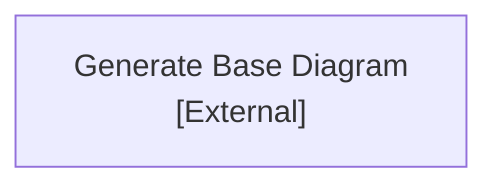
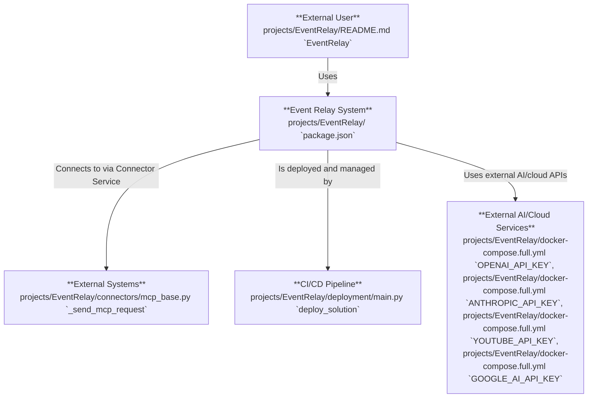
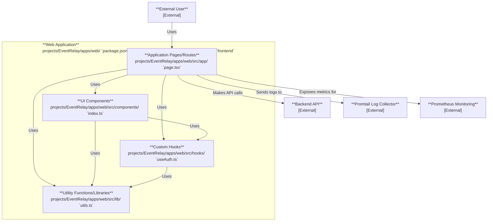

```mermaid
graph TD

    event_relay_container_diagram.cv::user["**External User**<br>projects/EventRelay/README.md `EventRelay`"]
    event_relay_container_diagram.cv::externalSystems["**External Systems**<br>projects/EventRelay/connectors/mcp_base.py `_send_mcp_request`"]
    event_relay_container_diagram.cv::ciCdPipeline["**CI/CD Pipeline**<br>projects/EventRelay/deployment/main.py `deploy_solution`"]
    event_relay_container_diagram.cv::aiCloudServices["**External AI/Cloud Services**<br>projects/EventRelay/docker-compose.full.yml `OPENAI_API_KEY`, projects/EventRelay/docker-compose.full.yml `ANTHROPIC_API_KEY`, projects/EventRelay/docker-compose.full.yml `YOUTUBE_API_KEY`, projects/EventRelay/docker-compose.full.yml `GOOGLE_AI_API_KEY`"]
    subgraph event_relay_container_diagram.cv::eventRelaySystemBoundary["**Event Relay System**<br>[External]"]
        event_relay_container_diagram.cv::webapp["**Web Application**<br>projects/EventRelay/apps/web/ `package.json`, projects/EventRelay/docker-compose.full.yml `frontend`"]
        event_relay_container_diagram.cv::backendApi["**Backend API**<br>projects/EventRelay/backend/ `__init__.py`, projects/EventRelay/docker-compose.full.yml `backend`"]
        event_relay_container_diagram.cv::orchestrator["**Orchestrator Service**<br>projects/EventRelay/docker-compose.full.yml `orchestrator`, projects/EventRelay/src/youtube_extension/orchestrator/main.py `main`"]
        event_relay_container_diagram.cv::database["**PostgreSQL Database**<br>projects/EventRelay/database/ `index_analysis.py`, projects/EventRelay/docker-compose.full.yml `postgres`"]
        event_relay_container_diagram.cv::prometheus["**Prometheus Monitoring**<br>projects/EventRelay/docker-compose.full.yml `prometheus`"]
        event_relay_container_diagram.cv::grafana["**Grafana Dashboard**<br>projects/EventRelay/docker-compose.full.yml `grafana`"]
        event_relay_container_diagram.cv::loki["**Loki Log Aggregation**<br>projects/EventRelay/docker-compose.full.yml `loki`"]
        event_relay_container_diagram.cv::promtail["**Promtail Log Collector**<br>projects/EventRelay/docker-compose.full.yml `promtail`"]
        %% Edges at this level (grouped by source)
        event_relay_container_diagram.cv::webapp["**Web Application**<br>projects/EventRelay/apps/web/ `package.json`, projects/EventRelay/docker-compose.full.yml `frontend`"] -->|"Makes API calls"| event_relay_container_diagram.cv::backendApi["**Backend API**<br>projects/EventRelay/backend/ `__init__.py`, projects/EventRelay/docker-compose.full.yml `backend`"]
        event_relay_container_diagram.cv::webapp["**Web Application**<br>projects/EventRelay/apps/web/ `package.json`, projects/EventRelay/docker-compose.full.yml `frontend`"] -->|"Sends logs to"| event_relay_container_diagram.cv::promtail["**Promtail Log Collector**<br>projects/EventRelay/docker-compose.full.yml `promtail`"]
        event_relay_container_diagram.cv::webapp["**Web Application**<br>projects/EventRelay/apps/web/ `package.json`, projects/EventRelay/docker-compose.full.yml `frontend`"] -->|"Exposes metrics for"| event_relay_container_diagram.cv::prometheus["**Prometheus Monitoring**<br>projects/EventRelay/docker-compose.full.yml `prometheus`"]
        event_relay_container_diagram.cv::backendApi["**Backend API**<br>projects/EventRelay/backend/ `__init__.py`, projects/EventRelay/docker-compose.full.yml `backend`"] -->|"Reads from and writes to"| event_relay_container_diagram.cv::database["**PostgreSQL Database**<br>projects/EventRelay/database/ `index_analysis.py`, projects/EventRelay/docker-compose.full.yml `postgres`"]
        event_relay_container_diagram.cv::backendApi["**Backend API**<br>projects/EventRelay/backend/ `__init__.py`, projects/EventRelay/docker-compose.full.yml `backend`"] -->|"Sends logs to"| event_relay_container_diagram.cv::promtail["**Promtail Log Collector**<br>projects/EventRelay/docker-compose.full.yml `promtail`"]
        event_relay_container_diagram.cv::backendApi["**Backend API**<br>projects/EventRelay/backend/ `__init__.py`, projects/EventRelay/docker-compose.full.yml `backend`"] -->|"Exposes metrics for"| event_relay_container_diagram.cv::prometheus["**Prometheus Monitoring**<br>projects/EventRelay/docker-compose.full.yml `prometheus`"]
        event_relay_container_diagram.cv::orchestrator["**Orchestrator Service**<br>projects/EventRelay/docker-compose.full.yml `orchestrator`, projects/EventRelay/src/youtube_extension/orchestrator/main.py `main`"] -->|"Interacts with"| event_relay_container_diagram.cv::backendApi["**Backend API**<br>projects/EventRelay/backend/ `__init__.py`, projects/EventRelay/docker-compose.full.yml `backend`"]
        event_relay_container_diagram.cv::orchestrator["**Orchestrator Service**<br>projects/EventRelay/docker-compose.full.yml `orchestrator`, projects/EventRelay/src/youtube_extension/orchestrator/main.py `main`"] -->|"Sends logs to"| event_relay_container_diagram.cv::promtail["**Promtail Log Collector**<br>projects/EventRelay/docker-compose.full.yml `promtail`"]
        event_relay_container_diagram.cv::orchestrator["**Orchestrator Service**<br>projects/EventRelay/docker-compose.full.yml `orchestrator`, projects/EventRelay/src/youtube_extension/orchestrator/main.py `main`"] -->|"Exposes metrics for"| event_relay_container_diagram.cv::prometheus["**Prometheus Monitoring**<br>projects/EventRelay/docker-compose.full.yml `prometheus`"]
        event_relay_container_diagram.cv::grafana["**Grafana Dashboard**<br>projects/EventRelay/docker-compose.full.yml `grafana`"] -->|"Queries metrics from"| event_relay_container_diagram.cv::prometheus["**Prometheus Monitoring**<br>projects/EventRelay/docker-compose.full.yml `prometheus`"]
        event_relay_container_diagram.cv::grafana["**Grafana Dashboard**<br>projects/EventRelay/docker-compose.full.yml `grafana`"] -->|"Queries logs from"| event_relay_container_diagram.cv::loki["**Loki Log Aggregation**<br>projects/EventRelay/docker-compose.full.yml `loki`"]
        event_relay_container_diagram.cv::promtail["**Promtail Log Collector**<br>projects/EventRelay/docker-compose.full.yml `promtail`"] -->|"Ships logs to"| event_relay_container_diagram.cv::loki["**Loki Log Aggregation**<br>projects/EventRelay/docker-compose.full.yml `loki`"]
    end
    %% Edges at this level (grouped by source)
    event_relay_container_diagram.cv::user["**External User**<br>projects/EventRelay/README.md `EventRelay`"] -->|"Uses"| event_relay_container_diagram.cv::webapp["**Web Application**<br>projects/EventRelay/apps/web/ `package.json`, projects/EventRelay/docker-compose.full.yml `frontend`"]
    event_relay_container_diagram.cv::backendApi["**Backend API**<br>projects/EventRelay/backend/ `__init__.py`, projects/EventRelay/docker-compose.full.yml `backend`"] -->|"Connects to via Connector Service"| event_relay_container_diagram.cv::externalSystems["**External Systems**<br>projects/EventRelay/connectors/mcp_base.py `_send_mcp_request`"]
    event_relay_container_diagram.cv::backendApi["**Backend API**<br>projects/EventRelay/backend/ `__init__.py`, projects/EventRelay/docker-compose.full.yml `backend`"] -->|"Uses external AI/cloud APIs"| event_relay_container_diagram.cv::aiCloudServices["**External AI/Cloud Services**<br>projects/EventRelay/docker-compose.full.yml `OPENAI_API_KEY`, projects/EventRelay/docker-compose.full.yml `ANTHROPIC_API_KEY`, projects/EventRelay/docker-compose.full.yml `YOUTUBE_API_KEY`, projects/EventRelay/docker-compose.full.yml `GOOGLE_AI_API_KEY`"]
    event_relay_container_diagram.cv::ciCdPipeline["**CI/CD Pipeline**<br>projects/EventRelay/deployment/main.py `deploy_solution`"] -->|"Deploys and Manages"| event_relay_container_diagram.cv::eventRelaySystemBoundary["**Event Relay System**<br>[External]"]
    event_relay_container_diagram.cv::orchestrator["**Orchestrator Service**<br>projects/EventRelay/docker-compose.full.yml `orchestrator`, projects/EventRelay/src/youtube_extension/orchestrator/main.py `main`"] -->|"Uses external AI/cloud APIs"| event_relay_container_diagram.cv::aiCloudServices["**External AI/Cloud Services**<br>projects/EventRelay/docker-compose.full.yml `OPENAI_API_KEY`, projects/EventRelay/docker-compose.full.yml `ANTHROPIC_API_KEY`, projects/EventRelay/docker-compose.full.yml `YOUTUBE_API_KEY`, projects/EventRelay/docker-compose.full.yml `GOOGLE_AI_API_KEY`"]

```

# /Dev/OpenAI_Hub/projects/EventRelay CodeViz Diagram


# /Dev/OpenAI_Hub/projects/EventRelay CodeViz Diagram


# Unnamed CodeViz Diagram


# Unnamed CodeViz Diagram


# Unnamed CodeViz Diagram

```mermaid
graph TD

    orchestrator_component_diagram.cv::backendApi["**Backend API**<br>[External]"]
    orchestrator_component_diagram.cv::aiCloudServices["**External AI/Cloud Services**<br>[External]"]
    orchestrator_component_diagram.cv::promtail["**Promtail Log Collector**<br>[External]"]
    orchestrator_component_diagram.cv::prometheus["**Prometheus Monitoring**<br>[External]"]
    subgraph orchestrator_component_diagram.cv::orchestrator["**Orchestrator Service**<br>projects/EventRelay/docker-compose.full.yml `orchestrator`, projects/EventRelay/src/youtube_extension/orchestrator/main.py `main`"]
        orchestrator_component_diagram.cv::messageConsumer["**Message Consumer**<br>projects/EventRelay/src/youtube_extension/orchestrator/main.py `TODO: Implement RabbitMQ/Redis consumer here`"]
        orchestrator_component_diagram.cv::taskProcessor["**Task Processor**<br>projects/EventRelay/src/youtube_extension/orchestrator/main.py `process(msg)`"]
        orchestrator_component_diagram.cv::orchestratorLogger["**Logging Module**<br>projects/EventRelay/src/youtube_extension/orchestrator/main.py `logger = logging.getLogger("orchestrator")`"]
        %% Edges at this level (grouped by source)
        orchestrator_component_diagram.cv::messageConsumer["**Message Consumer**<br>projects/EventRelay/src/youtube_extension/orchestrator/main.py `TODO: Implement RabbitMQ/Redis consumer here`"] -->|"Dispatches tasks to"| orchestrator_component_diagram.cv::taskProcessor["**Task Processor**<br>projects/EventRelay/src/youtube_extension/orchestrator/main.py `process(msg)`"]
        orchestrator_component_diagram.cv::messageConsumer["**Message Consumer**<br>projects/EventRelay/src/youtube_extension/orchestrator/main.py `TODO: Implement RabbitMQ/Redis consumer here`"] -->|"Logs activity"| orchestrator_component_diagram.cv::orchestratorLogger["**Logging Module**<br>projects/EventRelay/src/youtube_extension/orchestrator/main.py `logger = logging.getLogger("orchestrator")`"]
        orchestrator_component_diagram.cv::taskProcessor["**Task Processor**<br>projects/EventRelay/src/youtube_extension/orchestrator/main.py `process(msg)`"] -->|"Logs processing status"| orchestrator_component_diagram.cv::orchestratorLogger["**Logging Module**<br>projects/EventRelay/src/youtube_extension/orchestrator/main.py `logger = logging.getLogger("orchestrator")`"]
    end
    %% Edges at this level (grouped by source)
    orchestrator_component_diagram.cv::taskProcessor["**Task Processor**<br>projects/EventRelay/src/youtube_extension/orchestrator/main.py `process(msg)`"] -->|"Interacts with"| orchestrator_component_diagram.cv::backendApi["**Backend API**<br>[External]"]
    orchestrator_component_diagram.cv::taskProcessor["**Task Processor**<br>projects/EventRelay/src/youtube_extension/orchestrator/main.py `process(msg)`"] -->|"Uses external AI/cloud APIs"| orchestrator_component_diagram.cv::aiCloudServices["**External AI/Cloud Services**<br>[External]"]
    orchestrator_component_diagram.cv::taskProcessor["**Task Processor**<br>projects/EventRelay/src/youtube_extension/orchestrator/main.py `process(msg)`"] -->|"Exposes metrics for"| orchestrator_component_diagram.cv::prometheus["**Prometheus Monitoring**<br>[External]"]
    orchestrator_component_diagram.cv::orchestratorLogger["**Logging Module**<br>projects/EventRelay/src/youtube_extension/orchestrator/main.py `logger = logging.getLogger("orchestrator")`"] -->|"Sends logs to"| orchestrator_component_diagram.cv::promtail["**Promtail Log Collector**<br>[External]"]

```
# Unnamed CodeViz Diagram


```mermaid
graph TD

    backendapi_component_diagram.cv::webapp["**Web Application**<br>[External]"]
    backendapi_component_diagram.cv::database["**PostgreSQL Database**<br>[External]"]
    backendapi_component_diagram.cv::connectorService["**Connector Service**<br>[External]"]
    backendapi_component_diagram.cv::aiCloudServices["**External AI/Cloud Services**<br>[External]"]
    backendapi_component_diagram.cv::promtail["**Promtail Log Collector**<br>[External]"]
    backendapi_component_diagram.cv::prometheus["**Prometheus Monitoring**<br>[External]"]
    subgraph backendapi_component_diagram.cv::backendApi["**Backend API**<br>projects/EventRelay/backend/ `__init__.py`, projects/EventRelay/docker-compose.full.yml `backend`"]
        backendapi_component_diagram.cv::apiServices["**API Services**<br>projects/EventRelay/backend/services/ `__init__.py`"]
        backendapi_component_diagram.cv::firebaseIntegration["**Firebase Integration**<br>projects/EventRelay/backend/firebase/ `__init__.py`"]
        %% Edges at this level (grouped by source)
        backendapi_component_diagram.cv::apiServices["**API Services**<br>projects/EventRelay/backend/services/ `__init__.py`"] -->|"Uses"| backendapi_component_diagram.cv::firebaseIntegration["**Firebase Integration**<br>projects/EventRelay/backend/firebase/ `__init__.py`"]
    end
    %% Edges at this level (grouped by source)
    backendapi_component_diagram.cv::webapp["**Web Application**<br>[External]"] -->|"Makes API calls"| backendapi_component_diagram.cv::apiServices["**API Services**<br>projects/EventRelay/backend/services/ `__init__.py`"]
    backendapi_component_diagram.cv::apiServices["**API Services**<br>projects/EventRelay/backend/services/ `__init__.py`"] -->|"Reads from and writes to"| backendapi_component_diagram.cv::database["**PostgreSQL Database**<br>[External]"]
    backendapi_component_diagram.cv::apiServices["**API Services**<br>projects/EventRelay/backend/services/ `__init__.py`"] -->|"Uses"| backendapi_component_diagram.cv::connectorService["**Connector Service**<br>[External]"]
    backendapi_component_diagram.cv::apiServices["**API Services**<br>projects/EventRelay/backend/services/ `__init__.py`"] -->|"Uses external AI/cloud APIs"| backendapi_component_diagram.cv::aiCloudServices["**External AI/Cloud Services**<br>[External]"]
    backendapi_component_diagram.cv::apiServices["**API Services**<br>projects/EventRelay/backend/services/ `__init__.py`"] -->|"Sends logs to"| backendapi_component_diagram.cv::promtail["**Promtail Log Collector**<br>[External]"]
    backendapi_component_diagram.cv::apiServices["**API Services**<br>projects/EventRelay/backend/services/ `__init__.py`"] -->|"Exposes metrics for"| backendapi_component_diagram.cv::prometheus["**Prometheus Monitoring**<br>[External]"]

```

---
*Generated by [CodeViz.ai](https://codeviz.ai) on 12/9/2025, 2:12:52 AM*
