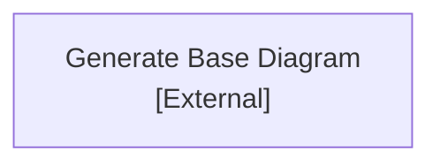

# Dev/OpenAI_Hub/projects/UVAI CodeViz Diagram

```mermaid
graph TD

    begin-diagram-generation["Generate Base Diagram<br>[External]"]

```
# Unnamed CodeViz Diagram

```mermaid
graph TD

    uvai_system_context.cv::user["**End User**<br>projects/UVAI/README.md `UVAI`"]
    uvai_system_context.cv::google_cloud["**Google Cloud SDK**<br>projects/UVAI/models/google-cloud-sdk/"]
    uvai_system_context.cv::grok4_client["**Grok-4 Client**<br>projects/UVAI/models/grok4-client/"]
    uvai_system_context.cv::llama_instruct["**Llama 3.1 8B Instruct**<br>projects/UVAI/models/llama-3.1-8b-instruct/"]
    uvai_system_context.cv::openai_models["**OpenAI Models**<br>projects/UVAI/models/openai/"]
    uvai_system_context.cv::deployment_system["**Deployment System**<br>projects/UVAI/deployment/deploy.py `deploy_uvai`, projects/UVAI/deployment/Dockerfile `FROM`"]
    subgraph uvai_system_context.cv::uvai_system_boundary["**Universal Automation and Intelligence**<br>[External]"]
        uvai_system_context.cv::mcp_orchestrator["**MCP Orchestrator**<br>projects/UVAI/mcp-ecosystem/start_ecosystem.py `start_ecosystem`, projects/UVAI/mcp-ecosystem/demo_hybrid_orchestration.py `orchestration_demo`"]
        uvai_system_context.cv::api_gateway["**API Gateway**<br>projects/UVAI/src/api/ `handleRequest`"]
        uvai_system_context.cv::agent_framework["**Agent Framework**<br>projects/UVAI/src/agents/ `AgentManager`"]
        uvai_system_context.cv::intelligence_core["**Intelligence Core**<br>projects/UVAI/src/intelligence/ `processIntelligence`"]
        uvai_system_context.cv::core_services["**Core Services**<br>projects/UVAI/src/core/ `initCoreServices`"]
        %% Edges at this level (grouped by source)
        uvai_system_context.cv::api_gateway["**API Gateway**<br>projects/UVAI/src/api/ `handleRequest`"] -->|"Routes requests to"| uvai_system_context.cv::mcp_orchestrator["**MCP Orchestrator**<br>projects/UVAI/mcp-ecosystem/start_ecosystem.py `start_ecosystem`, projects/UVAI/mcp-ecosystem/demo_hybrid_orchestration.py `orchestration_demo`"]
        uvai_system_context.cv::api_gateway["**API Gateway**<br>projects/UVAI/src/api/ `handleRequest`"] -->|"Routes requests to"| uvai_system_context.cv::agent_framework["**Agent Framework**<br>projects/UVAI/src/agents/ `AgentManager`"]
        uvai_system_context.cv::agent_framework["**Agent Framework**<br>projects/UVAI/src/agents/ `AgentManager`"] -->|"Utilizes"| uvai_system_context.cv::intelligence_core["**Intelligence Core**<br>projects/UVAI/src/intelligence/ `processIntelligence`"]
        uvai_system_context.cv::mcp_orchestrator["**MCP Orchestrator**<br>projects/UVAI/mcp-ecosystem/start_ecosystem.py `start_ecosystem`, projects/UVAI/mcp-ecosystem/demo_hybrid_orchestration.py `orchestration_demo`"] -->|"Utilizes"| uvai_system_context.cv::intelligence_core["**Intelligence Core**<br>projects/UVAI/src/intelligence/ `processIntelligence`"]
        uvai_system_context.cv::mcp_orchestrator["**MCP Orchestrator**<br>projects/UVAI/mcp-ecosystem/start_ecosystem.py `start_ecosystem`, projects/UVAI/mcp-ecosystem/demo_hybrid_orchestration.py `orchestration_demo`"] -->|"Manages/Uses"| uvai_system_context.cv::core_services["**Core Services**<br>projects/UVAI/src/core/ `initCoreServices`"]
    end
    %% Edges at this level (grouped by source)
    uvai_system_context.cv::user["**End User**<br>projects/UVAI/README.md `UVAI`"] -->|"Interacts with"| uvai_system_context.cv::uvai_system_boundary["**Universal Automation and Intelligence**<br>[External]"]
    uvai_system_context.cv::user["**End User**<br>projects/UVAI/README.md `UVAI`"] -->|"Makes requests to"| uvai_system_context.cv::api_gateway["**API Gateway**<br>projects/UVAI/src/api/ `handleRequest`"]
    uvai_system_context.cv::uvai_system_boundary["**Universal Automation and Intelligence**<br>[External]"] -->|"Uses"| uvai_system_context.cv::google_cloud["**Google Cloud SDK**<br>projects/UVAI/models/google-cloud-sdk/"]
    uvai_system_context.cv::uvai_system_boundary["**Universal Automation and Intelligence**<br>[External]"] -->|"Uses"| uvai_system_context.cv::grok4_client["**Grok-4 Client**<br>projects/UVAI/models/grok4-client/"]
    uvai_system_context.cv::uvai_system_boundary["**Universal Automation and Intelligence**<br>[External]"] -->|"Uses"| uvai_system_context.cv::llama_instruct["**Llama 3.1 8B Instruct**<br>projects/UVAI/models/llama-3.1-8b-instruct/"]
    uvai_system_context.cv::uvai_system_boundary["**Universal Automation and Intelligence**<br>[External]"] -->|"Uses"| uvai_system_context.cv::openai_models["**OpenAI Models**<br>projects/UVAI/models/openai/"]
    uvai_system_context.cv::deployment_system["**Deployment System**<br>projects/UVAI/deployment/deploy.py `deploy_uvai`, projects/UVAI/deployment/Dockerfile `FROM`"] -->|"Deploys and Manages"| uvai_system_context.cv::uvai_system_boundary["**Universal Automation and Intelligence**<br>[External]"]
    uvai_system_context.cv::mcp_orchestrator["**MCP Orchestrator**<br>projects/UVAI/mcp-ecosystem/start_ecosystem.py `start_ecosystem`, projects/UVAI/mcp-ecosystem/demo_hybrid_orchestration.py `orchestration_demo`"] -->|"Orchestrates/Uses"| uvai_system_context.cv::google_cloud["**Google Cloud SDK**<br>projects/UVAI/models/google-cloud-sdk/"]
    uvai_system_context.cv::mcp_orchestrator["**MCP Orchestrator**<br>projects/UVAI/mcp-ecosystem/start_ecosystem.py `start_ecosystem`, projects/UVAI/mcp-ecosystem/demo_hybrid_orchestration.py `orchestration_demo`"] -->|"Orchestrates/Uses"| uvai_system_context.cv::grok4_client["**Grok-4 Client**<br>projects/UVAI/models/grok4-client/"]
    uvai_system_context.cv::mcp_orchestrator["**MCP Orchestrator**<br>projects/UVAI/mcp-ecosystem/start_ecosystem.py `start_ecosystem`, projects/UVAI/mcp-ecosystem/demo_hybrid_orchestration.py `orchestration_demo`"] -->|"Orchestrates/Uses"| uvai_system_context.cv::llama_instruct["**Llama 3.1 8B Instruct**<br>projects/UVAI/models/llama-3.1-8b-instruct/"]
    uvai_system_context.cv::mcp_orchestrator["**MCP Orchestrator**<br>projects/UVAI/mcp-ecosystem/start_ecosystem.py `start_ecosystem`, projects/UVAI/mcp-ecosystem/demo_hybrid_orchestration.py `orchestration_demo`"] -->|"Orchestrates/Uses"| uvai_system_context.cv::openai_models["**OpenAI Models**<br>projects/UVAI/models/openai/"]
    uvai_system_context.cv::intelligence_core["**Intelligence Core**<br>projects/UVAI/src/intelligence/ `processIntelligence`"] -->|"Leverages"| uvai_system_context.cv::google_cloud["**Google Cloud SDK**<br>projects/UVAI/models/google-cloud-sdk/"]
    uvai_system_context.cv::intelligence_core["**Intelligence Core**<br>projects/UVAI/src/intelligence/ `processIntelligence`"] -->|"Leverages"| uvai_system_context.cv::grok4_client["**Grok-4 Client**<br>projects/UVAI/models/grok4-client/"]
    uvai_system_context.cv::intelligence_core["**Intelligence Core**<br>projects/UVAI/src/intelligence/ `processIntelligence`"] -->|"Leverages"| uvai_system_context.cv::llama_instruct["**Llama 3.1 8B Instruct**<br>projects/UVAI/models/llama-3.1-8b-instruct/"]
    uvai_system_context.cv::intelligence_core["**Intelligence Core**<br>projects/UVAI/src/intelligence/ `processIntelligence`"] -->|"Leverages"| uvai_system_context.cv::openai_models["**OpenAI Models**<br>projects/UVAI/models/openai/"]

```
---
*Generated by [CodeViz.ai](https://codeviz.ai) on 12/9/2025, 2:19:48 AM*
