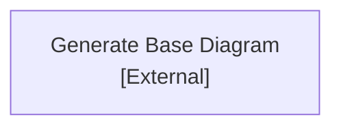

# Dev/OpenAI_Hub/projects/software-on-demand named CodeViz Diagram


# Unnamed CodeViz Diagram

```mermaid
graph TD

    software_on_demand.cv::begin-diagram-generation["**Generate Base Diagram**<br>[External]"]
    software_on_demand.cv::user["**Developer / QA Engineer**<br>[External]"]
    software_on_demand.cv::ajv["**AJV**<br>projects/software-on-demand/package.json `"ajv"`, projects/software-on-demand/src/validators.mjs `new Ajv2020`"]
    software_on_demand.cv::ajvFormats["**AJV Formats**<br>projects/software-on-demand/package.json `"ajv-formats"`, projects/software-on-demand/src/validators.mjs `addFormats(ajv)`"]
    software_on_demand.cv::yamlParser["**YAML Parser**<br>projects/software-on-demand/package.json `"yaml"`, projects/software-on-demand/src/validators.mjs `parseYaml`"]
    subgraph software_on_demand.cv::softwareOnDemandRuntime["**Software-On-Demand Multi-Agent Runtime**<br>[External]"]
        software_on_demand.cv::schemasAndValidation["**Schemas & Validation Project**<br>projects/software-on-demand/README.md `This directory hosts schema definitions`, projects/software-on-demand/package.json `software-on-demand`"]
    end
    subgraph software_on_demand.cv::schemasAndValidationProject["**Schemas & Validation Project**<br>[External]"]
        software_on_demand.cv::validators["**Validators**<br>projects/software-on-demand/src/validators.mjs `validateStepGraph`, projects/software-on-demand/src/validators.mjs `validateTraceEvent`, projects/software-on-demand/src/validators.mjs `loadGoldSetEvaluationFromFile`"]
        software_on_demand.cv::stepGraphSchema["**Step Graph Schema**<br>projects/software-on-demand/step_graph.schema.json `"$schema"`"]
        software_on_demand.cv::traceUiEventSchema["**Trace UI Event Schema**<br>projects/software-on-demand/trace_ui_event_schema.json `"$schema"`"]
        software_on_demand.cv::goldSetTemplate["**Gold Set Evaluation Template**<br>projects/software-on-demand/gold_set_evaluation_template.yaml `metadata:`"]
        software_on_demand.cv::validateSamplesScript["**Validate Samples Script**<br>projects/software-on-demand/scripts/validate-samples.mjs `import { validateStepGraph, validateTraceEvents }`"]
        software_on_demand.cv::validateRunScript["**Validate Run Script**<br>projects/software-on-demand/scripts/validate-run.mjs `import { validateStepGraph, validateTraceEvents, loadGoldSetEvaluationFromFile }`"]
        %% Edges at this level (grouped by source)
        software_on_demand.cv::validateSamplesScript["**Validate Samples Script**<br>projects/software-on-demand/scripts/validate-samples.mjs `import { validateStepGraph, validateTraceEvents }`"] -->|"Uses"| software_on_demand.cv::validators["**Validators**<br>projects/software-on-demand/src/validators.mjs `validateStepGraph`, projects/software-on-demand/src/validators.mjs `validateTraceEvent`, projects/software-on-demand/src/validators.mjs `loadGoldSetEvaluationFromFile`"]
        software_on_demand.cv::validateSamplesScript["**Validate Samples Script**<br>projects/software-on-demand/scripts/validate-samples.mjs `import { validateStepGraph, validateTraceEvents }`"] -->|"Validates against"| software_on_demand.cv::stepGraphSchema["**Step Graph Schema**<br>projects/software-on-demand/step_graph.schema.json `"$schema"`"]
        software_on_demand.cv::validateSamplesScript["**Validate Samples Script**<br>projects/software-on-demand/scripts/validate-samples.mjs `import { validateStepGraph, validateTraceEvents }`"] -->|"Validates against"| software_on_demand.cv::traceUiEventSchema["**Trace UI Event Schema**<br>projects/software-on-demand/trace_ui_event_schema.json `"$schema"`"]
        software_on_demand.cv::validateRunScript["**Validate Run Script**<br>projects/software-on-demand/scripts/validate-run.mjs `import { validateStepGraph, validateTraceEvents, loadGoldSetEvaluationFromFile }`"] -->|"Uses"| software_on_demand.cv::validators["**Validators**<br>projects/software-on-demand/src/validators.mjs `validateStepGraph`, projects/software-on-demand/src/validators.mjs `validateTraceEvent`, projects/software-on-demand/src/validators.mjs `loadGoldSetEvaluationFromFile`"]
        software_on_demand.cv::validateRunScript["**Validate Run Script**<br>projects/software-on-demand/scripts/validate-run.mjs `import { validateStepGraph, validateTraceEvents, loadGoldSetEvaluationFromFile }`"] -->|"Validates against"| software_on_demand.cv::stepGraphSchema["**Step Graph Schema**<br>projects/software-on-demand/step_graph.schema.json `"$schema"`"]
        software_on_demand.cv::validateRunScript["**Validate Run Script**<br>projects/software-on-demand/scripts/validate-run.mjs `import { validateStepGraph, validateTraceEvents, loadGoldSetEvaluationFromFile }`"] -->|"Validates against"| software_on_demand.cv::traceUiEventSchema["**Trace UI Event Schema**<br>projects/software-on-demand/trace_ui_event_schema.json `"$schema"`"]
        software_on_demand.cv::validateRunScript["**Validate Run Script**<br>projects/software-on-demand/scripts/validate-run.mjs `import { validateStepGraph, validateTraceEvents, loadGoldSetEvaluationFromFile }`"] -->|"Validates against"| software_on_demand.cv::goldSetTemplate["**Gold Set Evaluation Template**<br>projects/software-on-demand/gold_set_evaluation_template.yaml `metadata:`"]
        software_on_demand.cv::validators["**Validators**<br>projects/software-on-demand/src/validators.mjs `validateStepGraph`, projects/software-on-demand/src/validators.mjs `validateTraceEvent`, projects/software-on-demand/src/validators.mjs `loadGoldSetEvaluationFromFile`"] -->|"Reads and compiles"| software_on_demand.cv::stepGraphSchema["**Step Graph Schema**<br>projects/software-on-demand/step_graph.schema.json `"$schema"`"]
        software_on_demand.cv::validators["**Validators**<br>projects/software-on-demand/src/validators.mjs `validateStepGraph`, projects/software-on-demand/src/validators.mjs `validateTraceEvent`, projects/software-on-demand/src/validators.mjs `loadGoldSetEvaluationFromFile`"] -->|"Reads and compiles"| software_on_demand.cv::traceUiEventSchema["**Trace UI Event Schema**<br>projects/software-on-demand/trace_ui_event_schema.json `"$schema"`"]
        software_on_demand.cv::validators["**Validators**<br>projects/software-on-demand/src/validators.mjs `validateStepGraph`, projects/software-on-demand/src/validators.mjs `validateTraceEvent`, projects/software-on-demand/src/validators.mjs `loadGoldSetEvaluationFromFile`"] -->|"Parses"| software_on_demand.cv::goldSetTemplate["**Gold Set Evaluation Template**<br>projects/software-on-demand/gold_set_evaluation_template.yaml `metadata:`"]
    end
    %% Edges at this level (grouped by source)
    software_on_demand.cv::user["**Developer / QA Engineer**<br>[External]"] -->|"Interacts with via CLI scripts"| software_on_demand.cv::schemasAndValidation["**Schemas & Validation Project**<br>projects/software-on-demand/README.md `This directory hosts schema definitions`, projects/software-on-demand/package.json `software-on-demand`"]
    software_on_demand.cv::validators["**Validators**<br>projects/software-on-demand/src/validators.mjs `validateStepGraph`, projects/software-on-demand/src/validators.mjs `validateTraceEvent`, projects/software-on-demand/src/validators.mjs `loadGoldSetEvaluationFromFile`"] -->|"Uses for validation"| software_on_demand.cv::ajv["**AJV**<br>projects/software-on-demand/package.json `"ajv"`, projects/software-on-demand/src/validators.mjs `new Ajv2020`"]
    software_on_demand.cv::validators["**Validators**<br>projects/software-on-demand/src/validators.mjs `validateStepGraph`, projects/software-on-demand/src/validators.mjs `validateTraceEvent`, projects/software-on-demand/src/validators.mjs `loadGoldSetEvaluationFromFile`"] -->|"Uses for format validation"| software_on_demand.cv::ajvFormats["**AJV Formats**<br>projects/software-on-demand/package.json `"ajv-formats"`, projects/software-on-demand/src/validators.mjs `addFormats(ajv)`"]
    software_on_demand.cv::validators["**Validators**<br>projects/software-on-demand/src/validators.mjs `validateStepGraph`, projects/software-on-demand/src/validators.mjs `validateTraceEvent`, projects/software-on-demand/src/validators.mjs `loadGoldSetEvaluationFromFile`"] -->|"Uses for parsing YAML"| software_on_demand.cv::yamlParser["**YAML Parser**<br>projects/software-on-demand/package.json `"yaml"`, projects/software-on-demand/src/validators.mjs `parseYaml`"]

```
---
*Generated by [CodeViz.ai](https://codeviz.ai) on 12/9/2025, 2:24:06 AM*
