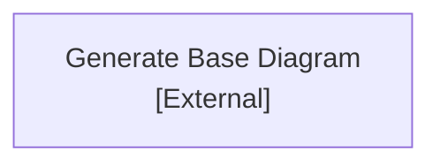
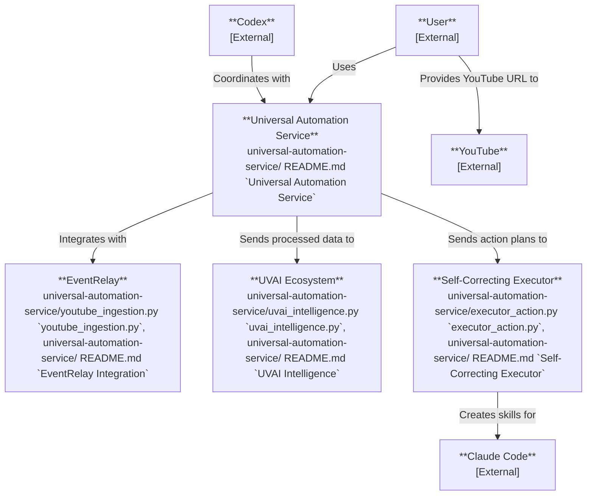

# Dev/OpenAI_Hub/universal-automation-service CodeViz Diagram

```mermaid
graph TD

    begin-diagram-generation["Generate Base Diagram<br>[External]"]

```
# Unnamed CodeViz Diagram

```mermaid
graph TD

    universal_automation_service_context.cv::user["**User**<br>[External]"]
    universal_automation_service_context.cv::universal_automation_service["**Universal Automation Service**<br>universal-automation-service/ README.md `Universal Automation Service`"]
    universal_automation_service_context.cv::youtube["**YouTube**<br>[External]"]
    universal_automation_service_context.cv::event_relay["**EventRelay**<br>universal-automation-service/youtube_ingestion.py `youtube_ingestion.py`, universal-automation-service/ README.md `EventRelay Integration`"]
    universal_automation_service_context.cv::uvai_ecosystem["**UVAI Ecosystem**<br>universal-automation-service/uvai_intelligence.py `uvai_intelligence.py`, universal-automation-service/ README.md `UVAI Intelligence`"]
    universal_automation_service_context.cv::self_correcting_executor["**Self-Correcting Executor**<br>universal-automation-service/executor_action.py `executor_action.py`, universal-automation-service/ README.md `Self-Correcting Executor`"]
    universal_automation_service_context.cv::claude_code["**Claude Code**<br>[External]"]
    universal_automation_service_context.cv::codex["**Codex**<br>[External]"]
    %% Edges at this level (grouped by source)
    universal_automation_service_context.cv::user["**User**<br>[External]"] -->|"Uses"| universal_automation_service_context.cv::universal_automation_service["**Universal Automation Service**<br>universal-automation-service/ README.md `Universal Automation Service`"]
    universal_automation_service_context.cv::user["**User**<br>[External]"] -->|"Provides YouTube URL to"| universal_automation_service_context.cv::youtube["**YouTube**<br>[External]"]
    universal_automation_service_context.cv::universal_automation_service["**Universal Automation Service**<br>universal-automation-service/ README.md `Universal Automation Service`"] -->|"Integrates with"| universal_automation_service_context.cv::event_relay["**EventRelay**<br>universal-automation-service/youtube_ingestion.py `youtube_ingestion.py`, universal-automation-service/ README.md `EventRelay Integration`"]
    universal_automation_service_context.cv::universal_automation_service["**Universal Automation Service**<br>universal-automation-service/ README.md `Universal Automation Service`"] -->|"Sends processed data to"| universal_automation_service_context.cv::uvai_ecosystem["**UVAI Ecosystem**<br>universal-automation-service/uvai_intelligence.py `uvai_intelligence.py`, universal-automation-service/ README.md `UVAI Intelligence`"]
    universal_automation_service_context.cv::universal_automation_service["**Universal Automation Service**<br>universal-automation-service/ README.md `Universal Automation Service`"] -->|"Sends action plans to"| universal_automation_service_context.cv::self_correcting_executor["**Self-Correcting Executor**<br>universal-automation-service/executor_action.py `executor_action.py`, universal-automation-service/ README.md `Self-Correcting Executor`"]
    universal_automation_service_context.cv::self_correcting_executor["**Self-Correcting Executor**<br>universal-automation-service/executor_action.py `executor_action.py`, universal-automation-service/ README.md `Self-Correcting Executor`"] -->|"Creates skills for"| universal_automation_service_context.cv::claude_code["**Claude Code**<br>[External]"]
    universal_automation_service_context.cv::codex["**Codex**<br>[External]"] -->|"Coordinates with"| universal_automation_service_context.cv::universal_automation_service["**Universal Automation Service**<br>universal-automation-service/ README.md `Universal Automation Service`"]

```
---
*Generated by [CodeViz.ai](https://codeviz.ai) on 12/9/2025, 2:21:17 AM*
