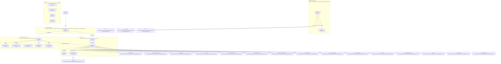

# Unnamed CodeViz Diagram

```mermaid
graph TD

    base.cv::end_user["End User<br>[External]"]
    base.cv::ajv["AJV<br>/Users/garvey/Dev/OpenAI_Hub/projects/software-on-demand/package.json"]
    base.cv::ajv_formats["AJV Formats<br>/Users/garvey/Dev/OpenAI_Hub/projects/software-on-demand/package.json"]
    base.cv::anthropic_api["Anthropic API<br>/Users/garvey/Dev/OpenAI_Hub/projects/EventRelay/pyproject.toml"]
    base.cv::chrome_devtools_mcp["Chrome DevTools MCP<br>/Users/garvey/Dev/OpenAI_Hub/projects/EventRelay/package.json"]
    base.cv::cohere_api["Cohere API<br>/Users/garvey/Dev/OpenAI_Hub/projects/EventRelay/pyproject.toml"]
    base.cv::fastapi["FastAPI<br>/Users/garvey/Dev/OpenAI_Hub/projects/EventRelay/pyproject.toml"]
    base.cv::google_cloud_speech["Google Cloud Speech<br>/Users/garvey/Dev/OpenAI_Hub/projects/EventRelay/pyproject.toml"]
    base.cv::google_generative_ai["Google Generative AI<br>/Users/garvey/Dev/OpenAI_Hub/projects/EventRelay/pyproject.toml"]
    base.cv::huggingface_transformers["Hugging Face Transformers<br>/Users/garvey/Dev/OpenAI_Hub/projects/EventRelay/pyproject.toml"]
    base.cv::langchain_core["LangChain Core<br>/Users/garvey/Dev/OpenAI_Hub/projects/EventRelay/package.json"]
    base.cv::langchain_langgraph["LangChain LangGraph<br>/Users/garvey/Dev/OpenAI_Hub/projects/EventRelay/package.json"]
    base.cv::langchain_openai["LangChain OpenAI<br>/Users/garvey/Dev/OpenAI_Hub/projects/EventRelay/package.json"]
    base.cv::openai_api["OpenAI API<br>/Users/garvey/Dev/OpenAI_Hub/projects/EventRelay/pyproject.toml"]
    base.cv::postgresql["PostgreSQL Database<br>/Users/garvey/Dev/OpenAI_Hub/projects/EventRelay/pyproject.toml"]
    base.cv::pytorch["PyTorch<br>/Users/garvey/Dev/OpenAI_Hub/projects/EventRelay/pyproject.toml"]
    base.cv::sqlalchemy["SQLAlchemy<br>/Users/garvey/Dev/OpenAI_Hub/projects/EventRelay/pyproject.toml"]
    base.cv::sqlite["SQLite Database<br>/Users/garvey/Dev/OpenAI_Hub/projects/EventRelay/pyproject.toml"]
    base.cv::yaml["YAML<br>/Users/garvey/Dev/OpenAI_Hub/projects/software-on-demand/package.json"]
    base.cv::youtube_api["YouTube API<br>/Users/garvey/Dev/OpenAI_Hub/projects/EventRelay/pyproject.toml"]
    subgraph base.cv::event_relay["Event Relay<br>/Users/garvey/Dev/OpenAI_Hub/projects/EventRelay/:1-999"]
        base.cv::er_frontend["Frontend<br>[External]"]
        base.cv::er_backend["Backend API<br>[External]"]
        base.cv::er_database["Database<br>[External]"]
        base.cv::er_youtube_packager["YouTube Packager<br>[External]"]
        %% Edges at this level (grouped by source)
        base.cv::er_frontend["Frontend<br>[External]"] -->|"Makes API calls"| base.cv::er_backend["Backend API<br>[External]"]
        base.cv::er_backend["Backend API<br>[External]"] -->|"Reads/Writes"| base.cv::er_database["Database<br>[External]"]
        base.cv::er_backend["Backend API<br>[External]"] -->|"Triggers processing"| base.cv::er_youtube_packager["YouTube Packager<br>[External]"]
    end
    subgraph base.cv::software_on_demand["Software On Demand<br>/Users/garvey/Dev/OpenAI_Hub/projects/software-on-demand/:1-999"]
        base.cv::sod_application["Application<br>[External]"]
        base.cv::sod_script_runner["Script Runner<br>[External]"]
        %% Edges at this level (grouped by source)
        base.cv::sod_application["Application<br>[External]"] -->|"Triggers"| base.cv::sod_script_runner["Script Runner<br>[External]"]
    end
    subgraph base.cv::universal_automation_service["Universal Automation Service<br>/Users/garvey/Dev/OpenAI_Hub/universal-automation-service/:1-999"]
        base.cv::uas_coordinator["Coordinator<br>[External]"]
        base.cv::uas_executor_action["Executor Action<br>[External]"]
        base.cv::uas_gemini_video_processor["Gemini Video Processor<br>[External]"]
        base.cv::uas_universal_coordinator["Universal Coordinator<br>[External]"]
        base.cv::uas_uvai_intelligence["UVAI Intelligence<br>[External]"]
        base.cv::uas_youtube_ingestion["YouTube Ingestion<br>[External]"]
        %% Edges at this level (grouped by source)
        base.cv::uas_coordinator["Coordinator<br>[External]"] -->|"Triggers"| base.cv::uas_executor_action["Executor Action<br>[External]"]
        base.cv::uas_coordinator["Coordinator<br>[External]"] -->|"Orchestrates"| base.cv::uas_gemini_video_processor["Gemini Video Processor<br>[External]"]
        base.cv::uas_coordinator["Coordinator<br>[External]"] -->|"Initiates"| base.cv::uas_youtube_ingestion["YouTube Ingestion<br>[External]"]
        base.cv::uas_coordinator["Coordinator<br>[External]"] -->|"Uses"| base.cv::uas_uvai_intelligence["UVAI Intelligence<br>[External]"]
    end
    subgraph base.cv::uvai["UVAI<br>/Users/garvey/Dev/OpenAI_Hub/projects/UVAI/:1-999"]
        base.cv::uvai_launcher["Automation Launcher<br>[External]"]
        base.cv::uvai_servers["Backend Servers<br>[External]"]
        base.cv::uvai_models["AI Models<br>[External]"]
        base.cv::uvai_integrations["Integrations<br>[External]"]
    end
    subgraph base.cv::dev_frontend_builder["Dev Frontend Builder<br>/Users/garvey/Dev/dev-frontend-builder/:1-999,/Users/garvey/Dev/dev-frontend-builder/src,/Users/garvey/Dev/dev-frontend-builder/dist"]
        base.cv::dev_frontend_builder_web_server["Web Server<br>[External]"]
    end
    %% Edges at this level (grouped by source)
    base.cv::dev_frontend_builder_web_server["Web Server<br>[External]"] -->|"Interacts with"| base.cv::er_frontend["Frontend<br>[External]"]
    base.cv::dev_frontend_builder_web_server["Web Server<br>[External]"] -->|"Interacts with"| base.cv::universal_automation_service["Universal Automation Service<br>/Users/garvey/Dev/OpenAI_Hub/universal-automation-service/:1-999"]
    base.cv::end_user["End User<br>[External]"] -->|"Uses"| base.cv::dev_frontend_builder_web_server["Web Server<br>[External]"]
    base.cv::er_backend["Backend API<br>[External]"] -->|"Uses"| base.cv::anthropic_api["Anthropic API<br>/Users/garvey/Dev/OpenAI_Hub/projects/EventRelay/pyproject.toml"]
    base.cv::er_backend["Backend API<br>[External]"] -->|"Uses"| base.cv::chrome_devtools_mcp["Chrome DevTools MCP<br>/Users/garvey/Dev/OpenAI_Hub/projects/EventRelay/package.json"]
    base.cv::er_backend["Backend API<br>[External]"] -->|"Uses"| base.cv::cohere_api["Cohere API<br>/Users/garvey/Dev/OpenAI_Hub/projects/EventRelay/pyproject.toml"]
    base.cv::er_backend["Backend API<br>[External]"] -->|"Uses"| base.cv::fastapi["FastAPI<br>/Users/garvey/Dev/OpenAI_Hub/projects/EventRelay/pyproject.toml"]
    base.cv::er_backend["Backend API<br>[External]"] -->|"Uses"| base.cv::google_cloud_speech["Google Cloud Speech<br>/Users/garvey/Dev/OpenAI_Hub/projects/EventRelay/pyproject.toml"]
    base.cv::er_backend["Backend API<br>[External]"] -->|"Uses"| base.cv::google_generative_ai["Google Generative AI<br>/Users/garvey/Dev/OpenAI_Hub/projects/EventRelay/pyproject.toml"]
    base.cv::er_backend["Backend API<br>[External]"] -->|"Uses"| base.cv::huggingface_transformers["Hugging Face Transformers<br>/Users/garvey/Dev/OpenAI_Hub/projects/EventRelay/pyproject.toml"]
    base.cv::er_backend["Backend API<br>[External]"] -->|"Uses"| base.cv::langchain_core["LangChain Core<br>/Users/garvey/Dev/OpenAI_Hub/projects/EventRelay/package.json"]
    base.cv::er_backend["Backend API<br>[External]"] -->|"Uses"| base.cv::langchain_langgraph["LangChain LangGraph<br>/Users/garvey/Dev/OpenAI_Hub/projects/EventRelay/package.json"]
    base.cv::er_backend["Backend API<br>[External]"] -->|"Uses"| base.cv::langchain_openai["LangChain OpenAI<br>/Users/garvey/Dev/OpenAI_Hub/projects/EventRelay/package.json"]
    base.cv::er_backend["Backend API<br>[External]"] -->|"Uses"| base.cv::openai_api["OpenAI API<br>/Users/garvey/Dev/OpenAI_Hub/projects/EventRelay/pyproject.toml"]
    base.cv::er_backend["Backend API<br>[External]"] -->|"Connects to"| base.cv::postgresql["PostgreSQL Database<br>/Users/garvey/Dev/OpenAI_Hub/projects/EventRelay/pyproject.toml"]
    base.cv::er_backend["Backend API<br>[External]"] -->|"Uses"| base.cv::pytorch["PyTorch<br>/Users/garvey/Dev/OpenAI_Hub/projects/EventRelay/pyproject.toml"]
    base.cv::er_backend["Backend API<br>[External]"] -->|"Uses"| base.cv::sqlalchemy["SQLAlchemy<br>/Users/garvey/Dev/OpenAI_Hub/projects/EventRelay/pyproject.toml"]
    base.cv::er_backend["Backend API<br>[External]"] -->|"Connects to"| base.cv::sqlite["SQLite Database<br>/Users/garvey/Dev/OpenAI_Hub/projects/EventRelay/pyproject.toml"]
    base.cv::er_youtube_packager["YouTube Packager<br>[External]"] -->|"Uses"| base.cv::youtube_api["YouTube API<br>/Users/garvey/Dev/OpenAI_Hub/projects/EventRelay/pyproject.toml"]
    base.cv::sod_application["Application<br>[External]"] -->|"Uses"| base.cv::ajv_formats["AJV Formats<br>/Users/garvey/Dev/OpenAI_Hub/projects/software-on-demand/package.json"]
    base.cv::sod_application["Application<br>[External]"] -->|"Uses"| base.cv::ajv["AJV<br>/Users/garvey/Dev/OpenAI_Hub/projects/software-on-demand/package.json"]
    base.cv::sod_application["Application<br>[External]"] -->|"Uses"| base.cv::yaml["YAML<br>/Users/garvey/Dev/OpenAI_Hub/projects/software-on-demand/package.json"]
    base.cv::uas_coordinator["Coordinator<br>[External]"] -->|"Sends/Receives events"| base.cv::er_backend["Backend API<br>[External]"]

```
---
*Generated by [CodeViz.ai](https://codeviz.ai) on 11/27/2025, 9:42:17 AM*
