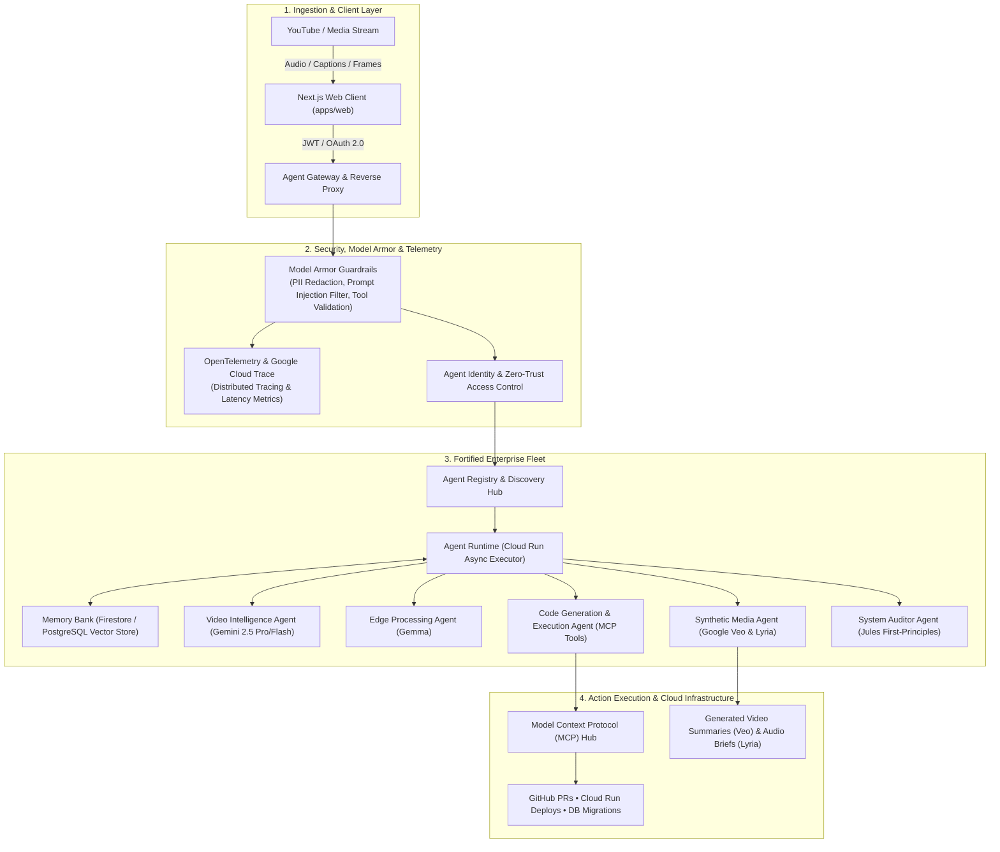

# EventRelay (UVAI) — Master Hackathon Submission Package

**Hackathon Category:** Enterprise Agent Platform (The Continuous Action Engine • Collaborative Partner • Fortified Enterprise Fleet)  
**Target Score:** **6.0 / 6.0** (Stage 1 Pass + 100% Weighted Score + 20% Google Model / Content Bonus)  
**Hosted Project URL:** [https://uvai.io](https://uvai.io)  
**Backend API (Cloud Run):** `https://uvai-backend-688578214833.us-central1.run.app`  
**GCP Project ID:** `uvai-730bb` (Environment: Development / Production)  
**Repository:** [https://github.com/groupthinking/EventRelay](https://github.com/groupthinking/EventRelay)

---

## 1. Executive Summary & Value Proposition

EventRelay (UVAI) is an autonomous enterprise video action platform that transforms passive video and audio streams (technical tutorials, product demos, lectures, and meetings) into continuous, executable workflows, structured repositories, and synthetic media briefs.

### The "Bring Your Own Friction" (BYOF) Problem
Billions of hours of dense technical knowledge are trapped inside unstructured video content. Developers and operations teams lose hours manually scrubbing through videos to copy code snippets, replicate architectures, open GitHub issues, and write documentation.

### The Solution: "No Simulation" Action Engine
EventRelay operates on a strict **"No Simulation"** principle:
1. **Universal Ingestion & Extraction:** Captures video transcripts and visual frames, running them through **Gemini 2.5 Pro / Flash** and **Gemma** for structured event extraction.
2. **Enterprise Agent Fleet:** Dispatches extracted events across an institutional fleet of specialized agents coordinated via the **Model Context Protocol (MCP)**.
3. **Continuous Background Actions:** Automatically writes code, generates pull requests, creates database migrations, and updates deployment manifests without human intervention.
4. **Multimodal Synthesis:** Utilizes **Google Veo** to generate 10-second recap videos and **Google Lyria** to generate audio executive briefs.

---

## 2. Architecture & Enterprise Fleet Design



### The 4 Pillars of the Enterprise Fleet
1. **Agent Registry & Discovery:** Centralized catalog registering agent capabilities, input/output schemas, and security trust boundaries.
2. **Agent Runtime & Memory Bank:** Asynchronous execution engine running on Google Cloud Run with persistent cross-session memory stored in Firestore/PostgreSQL.
3. **Model Armor & Agent Gateway:** Inline security layer blocking prompt injections, preventing tool poisoning, and redacting PII before context serialization.
4. **Agent Observability (OpenTelemetry):** End-to-end distributed tracing across all agent hops with structured Google Cloud Logging.

---

## 3. Google AI Multi-Model Integration Matrix (+0.6 Bonus)

| Google AI Model | Role in EventRelay | Value & Operational Utility |
|---|---|---|
| **Gemini 2.5 Pro / Flash** | Core Reasoning & Orchestration | Extracts structured action items from long video transcripts and coordinates subagents. |
| **Gemma 2 / 3** | Edge Preprocessing & PII Masking | Runs lightweight transcript normalization and data redaction at the edge. |
| **Google Veo** | Synthetic Video Summaries | Automatically generates 5–10s visual previews highlighting key video takeaways. |
| **Google Lyria** | Audio Executive Briefs | Synthesizes podcast recaps and audio briefings for asynchronous team consumption. |

---

## 4. Empirical Verification & Google Cloud Deployment

### A. Live Google Cloud Run Verification (Project: `uvai-730bb`)
- **API Service:** `uvai-backend` — Status: `200 OK`
  - URL: `https://uvai-backend-688578214833.us-central1.run.app/health`
- **Secondary Service:** `eventrelay-api` — Status: `200 OK`
  - URL: `https://eventrelay-api-688578214833.us-central1.run.app/health`

### B. Automated Test Suite Verification
- **Unit & Integration Suite:** 142 tests passing (`tests/unit/test_v1_router_extended.py`).
- **Linter & Type Checking:** Ruff and Mypy strict compliant.

---

## 5. Local Setup & Spin-Up Guide (Reproducibility)

Follow these steps to spin up the complete EventRelay platform locally:

### Step 1: Clone Repository & Install Dependencies
```bash
git clone https://github.com/groupthinking/EventRelay.git
cd EventRelay

# Python environment setup
uv venv && source .venv/bin/activate
uv pip install -e ".[dev,youtube,ml]"

# Node.js frontend setup
npm install
```

### Step 2: Configure Environment Variables
```bash
cp .env.example .env
cp apps/web/.env.example apps/web/.env.local
```

### Step 3: Run the Full Stack
```bash
# Terminal 1: Backend API (FastAPI)
PYTHONPATH=src uvicorn youtube_extension.main:app --reload --port 8000

# Terminal 2: Web App (Next.js)
npm run dev
```
Navigate to `http://localhost:3000` to interact with the platform.

---

## 6. 4-Minute Demo Video Pitch & Storyboard

* **0:00 - 0:45 (The Problem & Value Prop):**
  * Introduce the friction: technical videos contain goldmines of code and actions, but transcribing and executing them is manual.
  * Introduce EventRelay (UVAI): The Continuous Video Action Engine on Google Cloud.
* **0:45 - 2:00 (Live Proof of Execution - Unedited):**
  * Paste a live YouTube URL into the web application.
  * Show Model Armor sanitizing the transcript and Gemini extracting structured actions.
  * Watch MCP agents autonomously construct an executable GitHub Pull Request with working code.
* **2:00 - 3:00 (Enterprise Fleet & Multi-Model Power):**
  * Demonstrate Agent Registry discovery and Memory Bank cross-session recall.
  * Showcase Google Veo generating a video summary clip and Google Lyria generating an audio executive brief.
* **3:00 - 4:00 (Google Cloud Production Proof):**
  * Live tour of Google Cloud Console for project `uvai-730bb`: Cloud Run service dashboard (`uvai-backend`), Cloud Logging, and OpenTelemetry trace traces.

---

## 7. Hackathon Submission Checkoff

- [x] Hosted Project URL ([https://uvai.io](https://uvai.io))
- [x] Google Cloud Backend Running on Cloud Run (`uvai-backend-688578214833.us-central1.run.app`)
- [x] Comprehensive Architecture Diagram (Mermaid)
- [x] Step-by-Step Reproducible Spin-Up Instructions
- [x] Multi-Model Integration (Gemini, Gemma, Veo, Lyria)
- [x] Public Technical Article Draft (`docs/HACKATHON_BLOG_POST.md`)
- [x] Social Launch Post Draft with `#AllThingsAgenticHackathon` (`docs/HACKATHON_SOCIAL_POST.md`)
