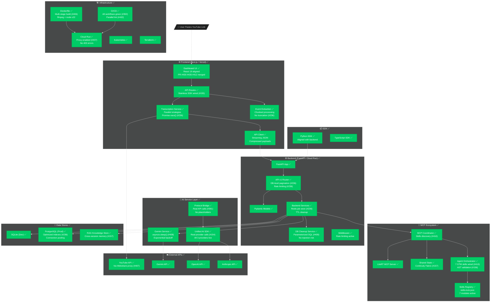

# EventRelay Architecture — Current State & Target State

## Color Legend

| Color | Meaning |
|-------|---------|
| 🔴 Red (`#ff4444`) | Critical issues / blocking errors |
| 🟠 Orange (`#ff8c00`) | High-priority issues / PRs needing attention |
| 🟡 Yellow (`#ffcc00`) | Medium-priority / in-progress work |
| 🟢 Green (`#00cc66`) | Healthy / working components |
| 🔵 Blue (`#4488ff`) | Open PRs / proposed changes |
| 🟣 Purple (`#aa44ff`) | Architecture gaps / unimplemented features |

---

## 1. Current State — What It Actually Looks Like

```mermaid
%%{init: {'theme': 'dark', 'themeVariables': {'fontSize': '14px'}}}%%
graph TB
    %% ===== USER ENTRY =====
    USER[/"👤 User Pastes YouTube Link"/]

    %% ===== FRONTEND LAYER =====
    subgraph FRONTEND["🌐 Frontend (Next.js / Vercel)"]
        direction TB
        DASH["Dashboard UI<br/>apps/web/src/app/dashboard"]
        API_ROUTES["API Routes<br/>apps/web/src/app/api/*"]
        TRANS_SVC["Transcription Service<br/>apps/web/src/lib/transcription-service.ts"]
        EVT_EXTRACT["Event Extraction Service<br/>apps/web/src/lib/event-extraction-service.ts"]
        API_CLIENT["API Client<br/>apps/web/src/lib/api-client.ts"]
    end

    %% ===== BACKEND LAYER =====
    subgraph BACKEND["⚙️ Backend (FastAPI / Cloud Run)"]
        direction TB
        MAIN_APP["FastAPI App<br/>src/youtube_extension/main.py"]
        ROUTER["API v1 Router<br/>src/youtube_extension/backend/api/v1/"]
        MODELS["Pydantic Models<br/>src/youtube_extension/backend/models/"]
        SERVICES["Backend Services<br/>src/youtube_extension/backend/services/"]
        DB_CLEANUP["DB Cleanup Service<br/>database_cleanup_service.py"]
        MIDDLEWARE["Middleware<br/>src/youtube_extension/backend/middleware/"]
    end

    %% ===== AI SERVICES =====
    subgraph AI_LAYER["🧠 AI Service Layer"]
        direction TB
        GEMINI_SVC["Gemini Service<br/>services/ai/gemini_service.py"]
        UNIFIED_SDK["Unified AI SDK<br/>src/unified_ai_sdk/"]
        PROTO_BRIDGE["Protocol Bridge<br/>core/mcp/protocol_bridge.py"]
    end

    %% ===== MCP ECOSYSTEM =====
    subgraph MCP_LAYER["🔌 MCP Ecosystem"]
        direction TB
        MCP_COORD["MCP Coordinator<br/>src/youtube_extension/mcp/"]
        LITERT["LiteRT MCP Server<br/>mcp-servers/litert-mcp/"]
        SHARED_STATE["Shared State Server<br/>mcp-servers/shared-state/"]
        AGENT_ORCH["Agent Orchestrator<br/>src/youtube_extension/services/agents/"]
    end

    %% ===== INFRASTRUCTURE =====
    subgraph INFRA["🏗️ Infrastructure"]
        direction TB
        DOCKERFILE["Dockerfile"]
        CLOUD_RUN["Cloud Run Deploy<br/>.github/workflows/deploy-cloud-run.yml"]
        CI_CD["CI/CD Pipelines<br/>.github/workflows/ci.yml"]
        K8S["Kubernetes Manifests<br/>infrastructure/k8s/"]
        TERRAFORM["Terraform<br/>infrastructure/terraform/"]
    end

    %% ===== SDK =====
    subgraph SDK_LAYER["📦 SDK"]
        direction TB
        PY_SDK["Python SDK<br/>sdk/python/eventrelay_sdk/"]
        TS_SDK["TypeScript SDK<br/>sdk/typescript/"]
    end

    %% ===== DATA STORES =====
    subgraph DATA["💾 Data Stores"]
        direction TB
        SQLITE["SQLite (Dev)"]
        POSTGRES["PostgreSQL (Prod)"]
        RAG_STORE["RAG Knowledge Store"]
    end

    %% ===== EXTERNAL SERVICES =====
    subgraph EXTERNAL["☁️ External APIs"]
        direction TB
        YOUTUBE_API["YouTube Data API v3"]
        GEMINI_API["Google Gemini API"]
        OPENAI_API["OpenAI API"]
        ANTHROPIC_API["Anthropic API"]
    end

    %% ===== CONNECTIONS =====
    USER --> DASH
    DASH --> API_ROUTES
    API_ROUTES --> TRANS_SVC
    API_ROUTES --> EVT_EXTRACT
    TRANS_SVC --> API_CLIENT
    API_CLIENT --> MAIN_APP
    MAIN_APP --> ROUTER
    ROUTER --> SERVICES
    ROUTER --> MODELS
    SERVICES --> DB_CLEANUP
    SERVICES --> GEMINI_SVC
    GEMINI_SVC --> GEMINI_API
    UNIFIED_SDK --> OPENAI_API
    UNIFIED_SDK --> ANTHROPIC_API
    PROTO_BRIDGE --> UNIFIED_SDK
    SERVICES --> MCP_COORD
    MCP_COORD --> LITERT
    MCP_COORD --> SHARED_STATE
    MCP_COORD --> AGENT_ORCH
    SERVICES --> SQLITE
    SERVICES --> POSTGRES
    SERVICES --> RAG_STORE
    TRANS_SVC --> YOUTUBE_API
    DOCKERFILE --> CLOUD_RUN
    CI_CD --> CLOUD_RUN
    PY_SDK --> MAIN_APP

    %% ===== ISSUE COLOR CODING =====
    %% Critical Issues (Red)
    style DB_CLEANUP fill:#ff4444,stroke:#cc0000,color:#fff
    style GEMINI_SVC fill:#ff4444,stroke:#cc0000,color:#fff
    style DOCKERFILE fill:#ff4444,stroke:#cc0000,color:#fff
    style UNIFIED_SDK fill:#ff4444,stroke:#cc0000,color:#fff
    style PROTO_BRIDGE fill:#ff4444,stroke:#cc0000,color:#fff

    %% High Priority (Orange)
    style TRANS_SVC fill:#ff8c00,stroke:#cc6600,color:#fff
    style ROUTER fill:#ff8c00,stroke:#cc6600,color:#fff
    style CI_CD fill:#ff8c00,stroke:#cc6600,color:#fff

    %% Architecture Gaps (Purple)
    style AGENT_ORCH fill:#aa44ff,stroke:#7700cc,color:#fff
    style RAG_STORE fill:#aa44ff,stroke:#7700cc,color:#fff

    %% Open PR Work (Blue)
    style DASH fill:#4488ff,stroke:#2266cc,color:#fff

    %% Healthy (Green)
    style MAIN_APP fill:#00cc66,stroke:#009944,color:#fff
    style MODELS fill:#00cc66,stroke:#009944,color:#fff
    style MIDDLEWARE fill:#00cc66,stroke:#009944,color:#fff
    style LITERT fill:#00cc66,stroke:#009944,color:#fff
    style SHARED_STATE fill:#00cc66,stroke:#009944,color:#fff
    style SQLITE fill:#00cc66,stroke:#009944,color:#fff
    style PY_SDK fill:#00cc66,stroke:#009944,color:#fff
```

---

## 2. Issue & PR Map — What's Connected to What

```mermaid
%%{init: {'theme': 'dark'}}%%
graph LR
    %% ===== CRITICAL ISSUES (Red) =====
    subgraph CRITICAL["🔴 CRITICAL — Production Blockers"]
        I406["#406 Dockerfile Rewrite<br/>ffmpeg+node missing<br/>Agent: Jules"]
        I407["#407 Webshare Proxy<br/>YouTube 403 blocks<br/>Agent: Codex"]
        I408["#408 time.sleep→asyncio<br/>Event loop blocking<br/>Agent: Claude"]
        I409["#409 SQL Injection Fix<br/>Parameterize queries<br/>Agent: Claude"]
    end

    %% ===== HIGH PRIORITY (Orange) =====
    subgraph HIGH["🟠 HIGH — Architectural & Performance"]
        I236["#236 Performance Issues<br/>13 identified problems<br/>Memory leaks, N+1, truncation"]
        I391["#391 MCP Placeholders<br/>REAL_MODE_ONLY violation<br/>Fake API responses"]
        I392["#392 CI Workflow Review<br/>Failing/outdated workflows"]
        I154["#154 unified_ai_sdk<br/>TODO placeholder stubs"]
    end

    %% ===== MEDIUM (Yellow) =====
    subgraph MEDIUM["🟡 MEDIUM — Architecture Gaps"]
        I155["#155 Stainless SDK<br/>Merged but unwired"]
        I156["#156 AST Validation<br/>No code gen validation"]
        I157["#157 State Continuity<br/>No cross-session memory"]
        I410["#410 uvai-skills GTM<br/>Integrate 7 skill modules<br/>Agent: Copilot"]
    end

    %% ===== LAUNCH (Blue) =====
    subgraph LAUNCH["🔵 LAUNCH — Testing & Production"]
        I153["#153 Testing & Launch<br/>Load tests, security<br/>E2E, deployment"]
    end

    %% ===== OPEN PRs =====
    subgraph PRS["📋 Key Open PRs"]
        PR435["#435 timerRef null type<br/>styled-jsx React 19"]
        PR434["#434 anthropic-wif-test<br/>CI workflow fix"]
        PR432["#432 Parallel lint jobs<br/>Auto-labeling, conventions"]
        PR430["#430 React 19 mismatch<br/>Pagination guard"]
        PR414["#414 Dockerfile rewrite<br/>Jules agent output"]
        PR412["#412 Fix Vercel build<br/>React/react-dom v19"]
        PR365["#365 AI Gateway<br/>Text+video consolidated"]
        PR316["#316 AST Validation<br/>Code gen layer"]
    end

    %% ===== DEPENDENCY CHAINS =====
    I406 -->|"blocks"| I407
    I407 -->|"blocks"| I410
    I408 -->|"blocks"| I410
    I409 -->|"blocks"| I410
    I406 -.->|"PR"| PR414
    I154 -->|"related"| I391
    I156 -.->|"PR"| PR316
    I236 -->|"includes"| I408
    I392 -.->|"PR"| PR434
    PR435 -->|"related"| PR430
    PR430 -->|"related"| PR412

    %% ===== FILE CONNECTIONS =====
    I406 ====>|"Dockerfile<br/>infrastructure/"| CRITICAL
    I408 ====>|"services/ai/<br/>gemini_service.py"| CRITICAL
    I409 ====>|"backend/services/<br/>database_cleanup_service.py"| CRITICAL
    I391 ====>|"core/mcp/<br/>protocol_bridge.py"| HIGH

    style CRITICAL fill:#2a0000,stroke:#ff4444
    style HIGH fill:#2a1500,stroke:#ff8c00
    style MEDIUM fill:#2a2a00,stroke:#ffcc00
    style LAUNCH fill:#001a2a,stroke:#4488ff
    style PRS fill:#1a0033,stroke:#aa44ff
```

---

## 3. Target State — After All Issues & PRs Resolved

---

## 4. Resolution Dependency Chain — Execution Order

```mermaid
%%{init: {'theme': 'dark'}}%%
gantt
    title Issue/PR Resolution Order (No Time Estimates — Priority Sequence Only)
    dateFormat X
    axisFormat %s

    section Phase 1: Critical Blockers
    #406 Dockerfile (Jules)           :crit, done, 0, 1
    #409 SQL Injection (Claude)       :crit, done, 0, 1
    #408 asyncio.sleep (Claude)       :crit, done, 0, 1
    #407 Webshare Proxy (Codex)       :crit, done, 1, 2

    section Phase 2: Architecture Fixes
    #391 MCP Placeholders             :active, 2, 3
    #154 unified_ai_sdk               :active, 2, 3
    #236 Performance (P0 items)       :active, 2, 4
    #392 CI Workflow Review            :active, 2, 3

    section Phase 3: Feature Completion
    #155 Stainless SDK Wiring         :3, 4
    #156 AST Validation               :3, 4
    #157 State Continuity Fabric      :3, 5
    #410 uvai-skills Integration      :4, 5

    section Phase 4: PRs & Polish
    PR #414 Dockerfile (merge)        :1, 2
    PR #412 Vercel Build Fix          :2, 3
    PR #430 React 19 Fix              :2, 3
    PR #435 timerRef Fix              :2, 3
    PR #365 AI Gateway                :3, 4
    PR #316 AST Layer                 :3, 4

    section Phase 5: Launch
    #153 Testing & Production Launch  :5, 6
```

---

## 5. Component Health Summary

| Component | Status | Issues/PRs | Files Affected |
|-----------|--------|-----------|----------------|
| **Dockerfile** | 🔴 Critical | #406, PR#414 | `Dockerfile`, `.dockerignore` |
| **Gemini Service** | 🔴 Critical | #408 | `services/ai/gemini_service.py` |
| **DB Cleanup** | 🔴 Critical | #409 | `backend/services/database_cleanup_service.py` |
| **YouTube Transcript** | 🔴 Critical | #407 | `services/download/`, `services/transcript/` |
| **Protocol Bridge** | 🟠 High | #391 | `core/mcp/protocol_bridge.py` |
| **Unified AI SDK** | 🟠 High | #154 | `src/unified_ai_sdk/` |
| **API Router** | 🟠 High | #236 | `backend/api/v1/router.py` |
| **CI/CD** | 🟠 High | #392, PR#434 | `.github/workflows/*.yml` |
| **Frontend (React)** | 🟡 Medium | PR#430, #435, #412 | `apps/web/src/` |
| **Agent Orchestrator** | 🟣 Gap | #410, #157 | `services/agents/`, `src/skills/` |
| **AST Validation** | 🟣 Gap | #156, PR#316 | New layer needed |
| **Stainless SDK** | 🟣 Gap | #155 | Frontend API client |
| **MCP Servers** | 🟢 Healthy | — | `mcp-servers/` |
| **Pydantic Models** | 🟢 Healthy | — | `backend/models/` |
| **Python SDK** | 🟢 Healthy | — | `sdk/python/` |

---

## 6. What Resolving Each Issue Unlocks

```mermaid
%%{init: {'theme': 'dark'}}%%
flowchart LR
    subgraph BLOCKED["Currently Blocked"]
        B1["Video Processing<br/>in Production"]
        B2["Agent Execution<br/>Pipeline"]
        B3["Marketing<br/>Automation"]
        B4["Production<br/>Launch"]
    end

    subgraph FIXES["Fix Chain"]
        F406["#406 Dockerfile"]
        F407["#407 Proxy"]
        F408["#408 Async"]
        F409["#409 SQL Safe"]
        F391["#391 Real APIs"]
        F154["#154 AI SDK"]
        F236["#236 Performance"]
        F410["#410 Skills"]
        F153["#153 Launch"]
    end

    F406 -->|"Enables ffmpeg<br/>+ node runtime"| B1
    F407 -->|"Unblocks YouTube<br/>transcript fetch"| B1
    F408 -->|"Fixes timeouts<br/>under load"| B1
    F409 -->|"Secures DB<br/>operations"| B4
    F391 -->|"Real AI<br/>responses"| B2
    F154 -->|"Multi-provider<br/>AI routing"| B2
    F236 -->|"Handles scale<br/>without crash"| B4
    F410 -->|"7 GTM skills<br/>wired in"| B3
    F153 -->|"Final gate<br/>to live"| B4

    B1 -->|"when fixed"| B2
    B2 -->|"when fixed"| B3
    B3 -->|"when fixed"| B4

    style BLOCKED fill:#2a0000,stroke:#ff4444
    style FIXES fill:#002a00,stroke:#00cc66
```

