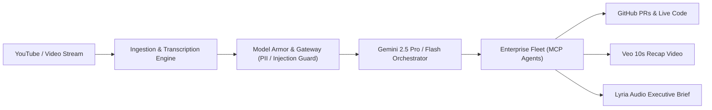

# Building an Autonomous Enterprise Video Action Engine on Google Cloud with Gemini & MCP

*I created this piece of content for the purposes of entering the #AllThingsAgenticHackathon.*

---

## The Video Knowledge Trap

Every day, software engineers, devops teams, and researchers watch thousands of hours of technical talks, architectural deep-dives, and tutorials on YouTube. 

Yet, converting that video knowledge into working software is agonizingly slow:
- You pause every 15 seconds to copy code off the screen.
- You cross-reference documentation to adapt outdated library versions.
- You manually create Jira tickets or GitHub issues to track the action items.

We built **EventRelay (UVAI)** to destroy this friction.

EventRelay is an autonomous **Continuous Action Engine** built on Google Cloud that takes a video stream and converts it directly into working code, executable pull requests, database migrations, and synthetic media briefings without human intervention.

---

## The Architecture: Fortified Enterprise Fleet

Rather than building a single monolithic prompt, EventRelay is engineered as a distributed, enterprise-grade multi-agent fleet powered by the **Model Context Protocol (MCP)** and Google Cloud.

### 1. Model Armor & Zero-Trust Governance
Before any transcript is ingested into the reasoning chain, our **Model Armor** pipeline applies inline PII scrubbing, input prompt injection guards, and strict Pydantic/Zod schema enforcement on tool inputs. This guarantees that unstructured community video data cannot poison enterprise agent workflows.

### 2. Multi-Model Google AI Orchestration
EventRelay leverages the full power of the Google AI model family:
- **Gemini 2.5 Pro & Flash:** Provides the heavy multimodal reasoning, understanding complex diagram frames and extracting high-fidelity structured event graphs from 2-hour long video transcripts.
- **Gemma:** Deployed at the edge for lightweight token preprocessing and local data classification.
- **Google Veo:** Generates concise 10-second summary videos capturing the key takeaways.
- **Google Lyria:** Synthesizes audio podcast recaps and voice briefings for team members on the go.

### 3. OpenTelemetry & Cloud Run Observability
EventRelay's backend is packaged into Docker containers and deployed to **Google Cloud Run** (`uvai-730bb`). Every step of the agent reasoning loop emits OpenTelemetry-compliant spans to **Google Cloud Trace** and structured JSON logs to **Cloud Logging**, providing complete auditability and latency tracking.

---

## From Video to Pull Request in 60 Seconds

When a user submits a video URL:
1. The backend captures the transcript and keyframe timeline.
2. The **Video Intelligence Agent** extracts actionable engineering tasks.
3. The **MCP Action Agent** checks out the target repository, generates the implementation code, writes unit tests, and pushes a working GitHub Pull Request.
4. The **Synthetic Media Agent** generates audio-visual briefs via Veo and Lyria.

---

## Lessons Learned & What's Next

Building an autonomous action engine taught us that **determinism and guardrails matter more than raw prompt creativity**. By decoupling extraction, policy enforcement (Model Armor), and tool execution (MCP), we created a system that doesn't just chat about videos—it actually executes them.

Try EventRelay today at [https://uvai.io](https://uvai.io) and check out our open-source codebase on GitHub!

#AllThingsAgenticHackathon #GoogleCloud #Gemini #VertexAI #ModelContextProtocol #AIagents
