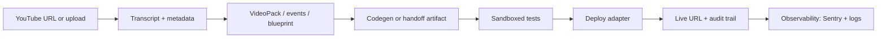

# EventRelay / UVAI — Master Roadmap to a Full Working System

**Last updated:** 2026-06-17  
**Repo baseline:** `feat/master-roadmap-phases` (implements Phases 1–6 code paths; Phase 1 provider keys remain dashboard ops)  
**Prior landings:** PRs [#295](https://github.com/groupthinking/EventRelay/pull/295), [#303](https://github.com/groupthinking/EventRelay/pull/303)  
**Live surface:** [uvai.io](https://uvai.io) · Vercel `garv1/v0-uvai` · Backend Cloud Run / Railway (misconfigured)

This document merges:

- Remaining post-merge work (CodeRabbit, Sentry, production env)
- [`EVENTRELAY_UVAI_BASELINE_AUDIT_AND_PLAN.md`](../EVENTRELAY_UVAI_BASELINE_AUDIT_AND_PLAN.md) phased plan
- [`docs/EventRelay-Full-System-Breakdown.md`](./EventRelay-Full-System-Breakdown.md) consolidation targets
- [`~/Downloads/see-script-ship-conversation-export`](file:///Users/garvey/Downloads/see-script-ship-conversation-export) — **YouTube-to-Repo** MVP sequence

---

## North star: “full working system”

A user can complete this loop **without manual intervention** and get an honest outcome every time:



**Definition of done (system-level):**

| Gate | Criterion |
|------|-----------|
| **CI** | `test`, `build`, `dependency-review`, E2E green on `main` |
| **Preview** | Vercel preview deploy succeeds (monorepo-root `npm ci`) |
| **Production web** | `uvai.io` 200, security headers, `/api/pipeline` bounded JSON |
| **Production AI** | Gemini + OpenAI calls succeed (billing/quota fixed) |
| **Production backend** | `BACKEND_URL` health returns 200, not 404/503 |
| **Pipeline** | Approved test video → VideoPack or explicit handoff (never silent fail) |
| **Observability** | Frontend + backend errors in Sentry with DSN |
| **Trust** | Agent steps auditable; VERA cannot crash pipeline on gateway error |

---

## What is already shipped (Phase 0 — complete)

| Area | Status | Evidence |
|------|--------|----------|
| Test suite restored | Done | PR #295, `bin/run_tests_clean.sh` |
| Security dep upgrades (vite/vitest) | Done | PR #295 |
| `dependency-review` | Done | `0BSD` for rollup; Sentry FSL via purls |
| Vercel preview install path | Done | PR #303: root `npm ci`, removed stale `apps/web/package-lock.json` |
| Sentry (web, partial) | Done | `@sentry/nextjs`, `sentry.*.config.ts`, webpack upload gated on `SENTRY_AUTH_TOKEN` |
| Ralph-loop demo scripts | Done | `dca23c7e` content on `main` via #295 squash (`demo_agent_pipeline.sh`, `start_mcp_youtube.sh`, orchestrator hardening) |
| Live landing | Up | `curl uvai.io` → 200; `/api/pipeline` returns pipeline metadata |

---

## Master phases (ordered by dependency)

### Phase 1 — Production environment gates (P0)

**Blocks real user value today.** Mostly Vercel / GCP / provider dashboard — not application code.

Source: [`docs/deployment/VERCEL_PRODUCTION_RUNBOOK.md`](./deployment/VERCEL_PRODUCTION_RUNBOOK.md)

| Item | Current state (2026-06-17) | Fix location | Verify |
|------|---------------------------|--------------|--------|
| `BACKEND_URL` | **Set** → `https://api.uvai.io` on Vercel | Redeploy production after env change | `curl -sS https://api.uvai.io/api/v1/health` |
| `api.uvai.io` | **200** healthy | Cloud Run min-instances=1 | `curl -sS https://api.uvai.io/api/v1/health` |
| `GEMINI_API_KEY` / billing | Live probes: no `BILLING_DISABLED` today | GCP billing if regressions return | POST `/api/pipeline` with test video |
| `OPENAI_API_KEY` | Live probes: transcribe **200** | OpenAI dashboard if regressions return | `/api/transcribe` |
| `SENTRY_DSN` (web) | **Set** on Vercel (`v0-uvai-web`) | Redeploy + client config PR pending | Deliberate smoke after deploy |
| `SENTRY_DSN` (backend) | **Set** on Cloud Run (`eventrelay-backend`) | — | Backend logs: Sentry initialized |
| `SENTRY_AUTH_TOKEN` | Optional — not set | Vercel env + Sentry auth token | Build log shows upload or clean skip |
| `GITHUB_TOKEN` | **Set** on Vercel | — | Pipeline deploy path (no "token not configured") |

**Smoke script (run after every prod promote):**

```bash
curl -sSI https://uvai.io/ | grep -Ei 'content-security-policy|strict-transport-security'
curl -sS https://uvai.io/api/pipeline
curl -sS -X POST https://uvai.io/api/pipeline \
  -H 'content-type: application/json' \
  --data '{"url":"https://www.youtube.com/watch?v=jNQXAC9IVRw"}'
```

**Exit criteria:** Pipeline POST returns progress or a **bounded** provider-outage message (not 500 stack trace).

---

### Phase 2 — Reliability hardening (P0/P1, code)

Source: CodeRabbit review threads on PR #295 (still valid on `main`).

| ID | Issue | File(s) | Fix (minimal) | Test |
|----|-------|---------|---------------|------|
| **R-001** | VERA `decision` unbound if gateway raises | `src/agents/pipeline_orchestrator.py` | Initialize `decision = None`; guard `if decision is not None and not decision.allowed` | Unit test: mock gateway raise → pipeline continues |
| **R-002** | No aiohttp session timeout | `enhanced_video_processor.py` | `ClientTimeout(total=30, connect=10, sock_read=20)` on shared session | Mock slow response → timeout, not hang |
| **R-003** | `build_plan` / `extracted_info` dropped from return | `enhanced_video_processor.py` | Include in response dict | Assert keys in processor test |
| **R-004** | `self.results` not reset per run | `pipeline_orchestrator.py` | `self.results = {}` at `run_pipeline` start | Two sequential runs → no cross-contamination |
| **R-005** | Placeholder `_generate_build_plan` in production path | `enhanced_video_processor.py` | Replace with real builder or mark `handoff_only` in response metadata | Integration test with golden VideoPack |

**Suggested PR stack:** `fix/vera-decision-guard` → `fix/processor-timeouts-and-payload` → `fix/orchestrator-state-reset`

**Exit criteria:** CodeRabbit re-review clean on touched files; `pytest tests/unit/ -m "not slow"` green.

---

### Phase 3 — Full observability (P1)

| Layer | Current | Target | Action |
|-------|---------|--------|--------|
| **Next.js** | `withSentryConfig` + server/edge configs | DSN live in preview/prod | Set `SENTRY_DSN` in Vercel |
| **Python** | `sentry-sdk` in `pyproject.toml`, **no `init`** | FastAPI ASGI integration | Add `sentry_sdk.init` in `src/youtube_extension/main.py` (or `backend/main.py`) with `SENTRY_DSN`, `traces_sample_rate`, `environment` |
| **Cross-service** | Separate projects recommended | `v0-uvai-web` + `eventrelay-backend` | Align with [`docs/SENTRY_SETUP.md`](../SENTRY_SETUP.md) |
| **CI gate** | None | Optional marker | `.verification-gate-pass` or workflow step after Sentry smoke |

**Exit criteria:** Deliberate `throw new Error("sentry-smoke")` on preview + `raise RuntimeError("sentry-smoke")` on backend both appear in Sentry within 60s.

---

### Phase 4 — YouTube-to-Repo MVP (P1)

Source: **see-script-ship** export (`~/Downloads/see-script-ship-conversation-export/conversation_visible_transcript.md`) — maps directly onto EventRelay’s existing architecture.

**MVP contract (from export):**

| Endpoint / capability | EventRelay today | Gap |
|----------------------|------------------|-----|
| `POST /video/analyze` | `/api/video`, `/api/pipeline`, backend `/api/v1/*` | Unify contract + SDK alignment |
| `POST /video/pack` | VideoPack artifacts in tests/fixtures | Persist + version VideoPacks |
| `POST /projects/blueprint` | `build_plan` models exist | Wire through API; stop dropping fields (R-003) |
| `POST /projects/generate` | `ai_code_generator.py` | AST validation before user sees output |
| `GET /jobs/{id}` | Async jobs in backend | Expose consistent job status schema |
| `WS /jobs/{id}/stream` | SSE `/api/pipeline/stream` | Align event shape with job lifecycle |
| Real transcript provider | YouTube captions + OpenAI STT | Document cloud IP limits; hosted fallback |
| Persistent storage | SQLite dev / PG prod | Migrations for packs, blueprints, jobs |
| GitHub App | Partial / scaffold | Repo create + push commits |
| Sandboxed tests | Missing | Container or subprocess runner before deploy |
| Deploy adapters | Vercel (web) | Add Netlify, Fly, Docker export per export spec |
| Repair loop | Not yet | **Only after** tests + logs + deploy telemetry (export rule) |

**Test video (canonical):** `https://youtu.be/vjdHAWvVCP4` (export) · CI default: `jNQXAC9IVRw` (E2E #292)

**Exit criteria:** One command (`scripts/demo_agent_pipeline.sh` or SDK) runs analyze → pack → blueprint → generate on test URL and produces a verifiable artifact directory + job audit log.

---

### Phase 5 — Product, SEO, and self-build (P2)

Source: [`EVENTRELAY_UVAI_BASELINE_AUDIT_AND_PLAN.md`](../EVENTRELAY_UVAI_BASELINE_AUDIT_AND_PLAN.md) Phases 1–2.

| Theme | Actions |
|-------|---------|
| **SEO / a11y** | JSON-LD HowTo on templates, ARIA on emoji icons, meta/OG per workflow |
| **Audit trail (IETF-inspired)** | Named agents in SSE payloads; `/api/v1/audit` or dashboard trace panel |
| **Retention** | Auth + job history (NextAuth already in tree) |
| **Self-build** | Meta-template: “Improve UVAI landing” — platform analyzes its own README/site |
| **Perf CI** | Lighthouse ≥ 90 in GitHub Actions on `apps/web` |

**Exit criteria:** Lighthouse CI artifact; audit endpoint returns last N pipeline steps for a job id.

---

### Phase 6 — Architecture consolidation (P3, 90-day horizon)

Source: [`docs/EventRelay-Full-System-Breakdown.md`](./EventRelay-Full-System-Breakdown.md), [`docs/development/ARCHITECTURAL_REFACTORING_ROADMAP.md`](./development/ARCHITECTURAL_REFACTORING_ROADMAP.md)

**Do not start until Phases 1–4 exit criteria pass** — consolidation without a working loop risks deleting the only working path.

| Target | Problem today | Direction |
|--------|---------------|-----------|
| Unified video processor | 5+ overlapping implementations | Single `VideoProcessorService` + strategy pattern |
| Unified MCP gateway | 17 servers, shared mutable `fabric.py` | Registry + gateway; remove shared mutable state |
| Coordinator merge | 4 orchestration entrypoints | `core/UnifiedCoordinator` + event bus |
| Dual DB writes | Firebase + Supabase without transactions | Pick authoritative store per entity |

---

## 14-day execution board (recommended order)

| Day | Track | Deliverable |
|-----|-------|-------------|
| 1 | Phase 1 | Fix Vercel `BACKEND_URL`, GCP billing, OpenAI quota — document values in runbook only (no secrets in repo) |
| 1 | Phase 1 | Run production smoke script; capture results in PR or issue |
| 2–3 | Phase 2 | PR: VERA `decision` guard (R-001) |
| 3–4 | Phase 2 | PR: aiohttp timeouts + build_plan payload (R-002, R-003) |
| 4 | Phase 2 | PR: orchestrator `self.results` reset (R-004) |
| 5–6 | Phase 3 | PR: Python `sentry_sdk.init` + env docs |
| 6 | Phase 3 | Set `SENTRY_DSN` in Vercel; smoke both surfaces |
| 7–10 | Phase 4 | PR: persist VideoPack + job status API alignment |
| 10–12 | Phase 4 | PR: sandbox test runner (minimal: `pytest` on generated tree) |
| 12–14 | Phase 4 | PR: deployment handoff artifact hardening (already started in dashboard-store) |

---

## Risk register

| Risk | Mitigation |
|------|------------|
| Provider keys/billing block all AI paths | Phase 1 first; bounded error responses already in web API routes |
| Stale per-app lockfile breaks Vercel again | **Never** commit `apps/web/package-lock.json`; root lockfile only (enforced in #303) |
| CodeRabbit blocks merge | Dismiss or fix; repo rules require PR + review hygiene |
| Placeholder build_plan ships to users | R-005 + REAL_MODE_ONLY policy: explicit `handoff` status in response |
| see-script-ship scope creep | Phase 4 stops at sandboxed generate + Vercel adapter; repair loop deferred |

---

## Source index

| Document | Path |
|----------|------|
| Baseline audit + phased plan | `EVENTRELAY_UVAI_BASELINE_AUDIT_AND_PLAN.md` |
| Full system breakdown | `docs/EventRelay-Full-System-Breakdown.md` |
| Architectural refactoring | `docs/development/ARCHITECTURAL_REFACTORING_ROADMAP.md` |
| Vercel production runbook | `docs/deployment/VERCEL_PRODUCTION_RUNBOOK.md` |
| Sentry setup | `docs/SENTRY_SETUP.md` |
| Security remediation | `docs/analysis/REMEDIATION_PLAN.md` |
| see-script-ship MVP export | `~/Downloads/see-script-ship-conversation-export/` |

---

## Implementation status (feat/master-roadmap-phases)

| Phase | Code status | Operator action still required |
|-------|-------------|-------------------------------|
| **1** | `scripts/deployment/production_smoke.sh` added | Vercel/GCP/OpenAI env vars + billing |
| **2** | VERA guard, aiohttp timeout, build_plan payload, results reset | — |
| **3** | Python `sentry_sdk.init` in `main.py` | Set `SENTRY_DSN` in backend deploy env |
| **4** | `PipelineJobStore`, `/video/analyze`, `/jobs/{id}`, sandbox runner | GitHub App + repair loop deferred |
| **5** | `/api/v1/audit/pipeline/*`, JSON-LD HowTo on web | Lighthouse CI deferred |
| **6** | `VideoProcessorFacade` entry hook | Full processor merge deferred (90d plan) |

## Changelog (roadmap maintenance)

| Date | Change |
|------|--------|
| 2026-06-17 | Initial master roadmap: merged post-#295/#303 state, CodeRabbit backlog, Sentry/env gaps, see-script-ship MVP track |
| 2026-06-17 | `feat/master-roadmap-phases`: Phases 2–6 code + Phase 1 smoke script |

*Append a row when a phase exit criterion is met or scope shifts.*