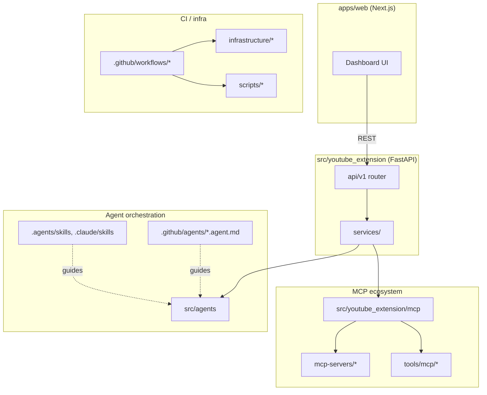

# EventRelay Repository Map

A directory-level map of this repository, kept separate from
[`ARCHITECTURE_DIAGRAM.md`](./ARCHITECTURE_DIAGRAM.md), which documents the
runtime data flow (YouTube link → transcript → events → agents → outputs)
in detail. This file answers "where does X live?"; `ARCHITECTURE_DIAGRAM.md`
answers "how does data move through the system?".

## Top-level layout

```
EventRelay/
├── src/                     # Python backend package (youtube_extension, agents, mcp, core, ...)
│   └── youtube_extension/
│       ├── backend/         # FastAPI app: api/v1/, services/, models/, middleware/
│       ├── services/        # Orchestration: agents/, workflows/, ai/
│       ├── mcp/              # MCP ecosystem coordinator
│       └── main.py           # FastAPI entry point
├── apps/
│   ├── web/                 # Next.js/React frontend (port 3000)
│   └── backend/             # Backend workspace app wrapper
├── packages/                # Shared monorepo packages (database, embeddings, etc.)
├── mcp-servers/             # Standalone MCP server implementations (langextract, vercel)
├── sdk/                     # Published client SDKs
│   ├── python/               # eventrelay_sdk (must stay aligned with backend/api/v1/models.py)
│   └── typescript/
├── tests/                   # Python tests: unit/, integration/, e2e/, fixtures/, workflows/
├── docs/                    # Extended documentation (this file, architecture, audits, guides)
├── infrastructure/          # Kubernetes manifests, Terraform, Cloud Run, database setup
├── scripts/                 # Operational and CI helper scripts (scripts/ci, scripts/maintenance, ...)
├── shared/                  # Cross-cutting shared code/config
├── tools/mcp/               # Local MCP servers used by agent tooling (e.g. git_workflow_server.mjs)
├── config/                  # Runtime configuration
├── data/, dataconnect/      # Data fixtures and Firebase Data Connect schema
├── supabase/                # Supabase functions/setup (auxiliary integration)
├── .github/                 # CI/CD workflows, agent instructions, MCP server config
│   ├── workflows/            # GitHub Actions + gh-aw agentic workflows (see workflows/README.md)
│   ├── agents/                # Per-domain Copilot agent instruction files
│   ├── agent/                 # Agent plans, rules, and task tracking
│   └── mcp-servers.json       # MCP servers wired into the Copilot cloud agent host
├── .agents/skills/, .claude/skills/  # Agent Skills (SKILL.md folders), mirrored per host
└── SKILL.md, AGENTS.md, CLAUDE.md, GEMINI.md  # Root-level agent/host instruction files
```

## Directory relationships



## Dependency summary

- **Python** (`pyproject.toml`, `requirements.txt`, `uv.lock`): FastAPI, SQLAlchemy +
  Alembic, google-genai / anthropic / openai clients, pytest + coverage.
- **JavaScript/TypeScript** (`package.json`, workspaces under `apps/*`): Turbo
  monorepo, Next.js (`apps/web`), `@modelcontextprotocol/sdk` (used by
  `tools/mcp/git_workflow_server.mjs`), Vitest.
- See `README.md` for the full setup/quickstart commands referenced by
  `AGENTS.md` / `CLAUDE.md` / `GEMINI.md`.

## Related documents

- [`ARCHITECTURE_DIAGRAM.md`](./ARCHITECTURE_DIAGRAM.md) — detailed runtime
  data-flow diagram (current vs. target state).
- [`AGENT_CAPABILITIES_CHECKLIST.md`](./AGENT_CAPABILITIES_CHECKLIST.md) —
  checklist of agent/tooling capabilities (agents, tools, MCP, git operations,
  issues, code, dependencies, database, actions, role assignment) mapped to
  what is actually implemented in this repository.
- [`.github/workflows/README.md`](../.github/workflows/README.md) — catalog of
  every GitHub Actions / gh-aw workflow.
