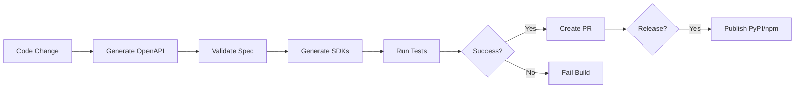

# Stainless SDK Integration - Implementation Summary

## Overview

This document summarizes the implementation of Stainless SDK integration for EventRelay, converting the platform from a tool into a consumable API with type-safe client libraries.

## Objectives Achieved ✅

1. ✅ Generated OpenAPI 3.1.0 specification from FastAPI backend
2. ✅ Created Stainless configuration for Python + TypeScript SDK generation
3. ✅ Set up automated SDK publishing workflow (GitHub Actions)
4. ✅ Created comprehensive documentation and usage examples
5. ✅ Established foundation for productizing EventRelay as a platform

## Files Created

### Core Configuration
- **`openapi.yaml`** (2,799 lines, 81KB)
  - Auto-generated from FastAPI routes and Pydantic models
  - OpenAPI 3.1.0 specification
  - 40 API endpoints
  - 28 component schemas
  - Stainless-compatible with full type definitions

- **`.stainless.yaml`** (99 lines, 1.9KB)
  - SDK generation configuration
  - Python SDK: `eventrelay` → PyPI as `eventrelay-sdk`
  - TypeScript SDK: `@groupthinking/eventrelay` → npm
  - Retries, pagination, streaming, and error handling enabled

### Scripts & Automation
- **`scripts/generate_openapi.py`** (1,179 bytes)
  - Automated OpenAPI spec generation from FastAPI app
  - Outputs YAML format for Stainless compatibility
  - Used by CI/CD pipeline

- **`.github/workflows/stainless-sdk.yml`** (7,462 bytes)
  - Validates OpenAPI spec
  - Generates Python and TypeScript SDKs
  - Runs tests on generated code
  - Publishes to PyPI (via OIDC) and npm (via token)
  - Creates PR with updated SDKs on spec changes

### Documentation
- **`docs/SDK_INTEGRATION.md`** (352 lines, 9.8KB)
  - Comprehensive SDK usage guide
  - Quick start examples for Python and TypeScript
  - Type safety, error handling, pagination, streaming
  - Architecture diagrams and API versioning strategy

- **`docs/STAINLESS_SETUP.md`** (311 lines, 6.5KB)
  - Step-by-step setup guide
  - Stainless authentication and configuration
  - GitHub Actions secrets setup
  - PyPI/npm publishing configuration
  - Troubleshooting and best practices

### SDK Examples
- **`examples/sdk_usage_python.py`** (246 lines, 7.3KB)
  - Synchronous and asynchronous examples
  - Streaming API usage
  - Pagination and batch processing
  - Comprehensive error handling
  - Ready-to-run demonstration code

- **`examples/sdk_usage_typescript.ts`** (279 lines, 7.4KB)
  - Promise-based async examples
  - Streaming and pagination
  - Webhook integration
  - Type-safe error handling
  - Production-ready patterns

### SDK Placeholders
- **`sdks/python/README.md`** (1,758 bytes)
  - Python SDK installation and quick start
  - Feature highlights
  - Development instructions

- **`sdks/typescript/README.md`** (1,922 bytes)
  - TypeScript SDK installation and quick start
  - Feature highlights
  - Development instructions

### Bug Fixes
- **`src/youtube_extension/services/workflows/transcript_action_workflow.py`**
  - Fixed import: `src.shared.youtube` → `shared.youtube`

- **`src/shared/youtube/__init__.py`**
  - Fixed imports: `src.youtube_extension` → `youtube_extension`

- **`.gitignore`**
  - Added SDK build artifacts to ignore list
  - Keeps README files while ignoring generated code

## Technical Architecture

### SDK Generation Flow

```
FastAPI Backend (Python)
  ↓ (Pydantic models + routes)
OpenAPI 3.1 Specification
  ↓ (Stainless SDK Generator)
├─→ Python SDK (eventrelay)
│   ├─ Sync client
│   ├─ Async client
│   ├─ Type hints
│   └─ Published to PyPI
│
└─→ TypeScript SDK (@groupthinking/eventrelay)
    ├─ Promise-based client
    ├─ TypeScript types
    ├─ IntelliSense support
    └─ Published to npm
```

### CI/CD Pipeline



## API Coverage

### OpenAPI Specification Stats
- **Version**: 3.1.0 (Stainless-compatible)
- **Endpoints**: 40 documented API paths
- **Schemas**: 28 Pydantic model components
- **Tags**: Health, Video Processing, Cache Management, Data & Analytics
- **Security**: ApiKeyAuth (header-based)

### Key Endpoints Covered
- Video processing: `/api/v1/process-video`, `/api/v1/videos/process`
- Event extraction: `/api/v1/events/extract`
- Agent dispatch: `/api/v1/agents/dispatch`, `/api/v1/agents/{agent_id}/status`
- Video-to-software: `/api/v1/video-to-software`
- Chat: `/api/v1/chat` (with streaming support)
- Health & monitoring: `/api/v1/health`, `/api/v1/metrics`
- Cache management: `/api/v1/cache/*`

## SDK Features

### Type Safety
- **Python**: Full type hints, Pydantic models, mypy compatibility
- **TypeScript**: Complete type definitions, IntelliSense, strict mode

### Advanced Capabilities
- **Automatic Retries**: Exponential backoff with configurable max attempts
- **Pagination**: Auto-pagination for list endpoints
- **Streaming**: Server-sent events for real-time responses
- **Error Handling**: Rich exception hierarchy with status codes
- **Async Support**: Python AsyncEventRelay, TypeScript promises

### Developer Experience
- IDE autocomplete and type checking
- Comprehensive error messages
- Built-in logging and debugging
- Idiomatic code that feels hand-crafted

## Strategic Impact

### Phase 2: Monetization (1-2 weeks)
This implementation fulfills the "Stainless + External API" phase of the strategic execution path:

1. ✅ **API as Product**: EventRelay is now consumable via SDK
2. ✅ **Developer Platform**: External developers can integrate Video-to-Anything
3. ✅ **Zero Integration Tax**: Type-safe SDKs eliminate manual API wrappers
4. ✅ **Automatic Updates**: CI/CD regenerates SDKs on API changes

### Business Value
- **Reduced friction**: Developers install SDKs vs. writing HTTP clients
- **Faster adoption**: Code examples and docs lower barrier to entry
- **Platform play**: EventRelay becomes infrastructure others build on
- **Monetization ready**: Usage tracking via API keys enables billing

## Next Steps

### Required for SDK Publishing

1. **Stainless Account Setup**
   - Create account at stainless.com
   - Generate API key
   - Add `STAINLESS_API_KEY` to GitHub secrets

2. **Package Registry Setup**
   - **PyPI**: Configure trusted publisher (OIDC, no token needed)
     - Project: `eventrelay-sdk`
     - Owner: `groupthinking`
     - Workflow: `stainless-sdk.yml`
   - **npm**: Generate automation token, add `NPM_TOKEN` to GitHub secrets
     - Scope: `@groupthinking`
     - Package: `@groupthinking/eventrelay`

3. **Initial SDK Generation**
   ```bash
   # Authenticate with Stainless
   stainless login

   # Generate SDKs
   stainless generate --language python --output ./sdks/python
   stainless generate --language typescript --output ./sdks/typescript

   # Test locally
   cd sdks/python && pip install -e ".[dev]" && pytest tests/
   cd ../typescript && npm install && npm test
   ```

4. **First Release**
   ```bash
   # Tag release
   git tag v1.0.0
   git push origin v1.0.0

   # Create GitHub release
   gh release create v1.0.0 \
     --title "EventRelay SDK v1.0.0" \
     --notes "Initial release of type-safe Python and TypeScript SDKs"

   # GitHub Actions will auto-publish to PyPI/npm
   ```

### Optional Enhancements

- **SDK Tests**: Add integration tests for generated SDKs
- **API Versioning**: Implement `/api/v2/` for breaking changes
- **Webhook Support**: Add webhook endpoints to OpenAPI spec
- **Rate Limiting**: Document rate limits in OpenAPI spec
- **Authentication**: Add OAuth2 flow to OpenAPI spec
- **Changelog**: Auto-generate SDK changelogs from commits

## Verification Checklist

- [x] OpenAPI spec generated (2,799 lines, valid YAML)
- [x] Stainless config created (.stainless.yaml)
- [x] GitHub Actions workflow configured
- [x] Python SDK example created (sync + async)
- [x] TypeScript SDK example created
- [x] Documentation written (SDK_INTEGRATION.md, STAINLESS_SETUP.md)
- [x] .gitignore updated for SDK artifacts
- [x] Import errors fixed (shared.youtube)
- [x] All files verified and committed

## Resources

### Internal Documentation
- [SDK Integration Guide](./SDK_INTEGRATION.md)
- [Stainless Setup Guide](./STAINLESS_SETUP.md)
- [Python SDK Example](../examples/sdk_usage_python.py)
- [TypeScript SDK Example](../examples/sdk_usage_typescript.ts)

### External References
- [Stainless Documentation](https://www.stainless.com/docs)
- [OpenAPI 3.1 Specification](https://spec.openapis.org/oas/v3.1.0)
- [FastAPI OpenAPI Support](https://fastapi.tiangolo.com/advanced/extending-openapi/)
- [PyPI Trusted Publishers](https://docs.pypi.org/trusted-publishers/)
- [npm Automation Tokens](https://docs.npmjs.com/creating-and-viewing-access-tokens)

## Support

- **GitHub Issues**: https://github.com/groupthinking/EventRelay/issues
- **Discussions**: https://github.com/groupthinking/EventRelay/discussions
- **Email**: team@uvai.com

---

**Implementation Date**: 2026-03-20
**Issue**: #94 - Integrate Stainless SDK for type-safe API client generation
**Status**: Complete ✅
