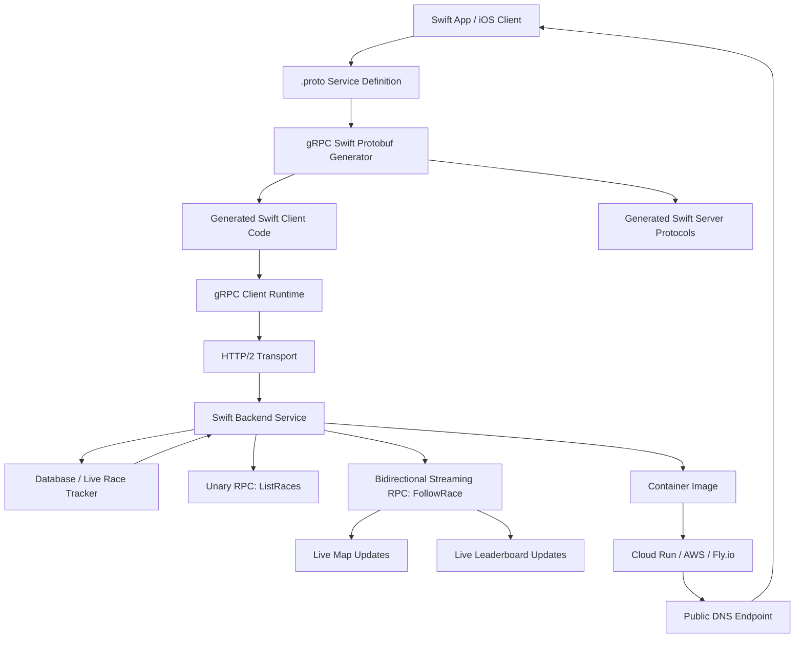
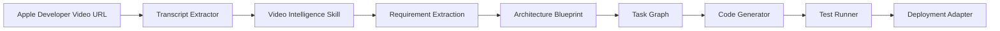
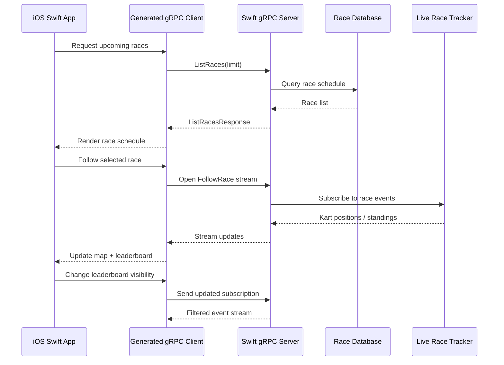
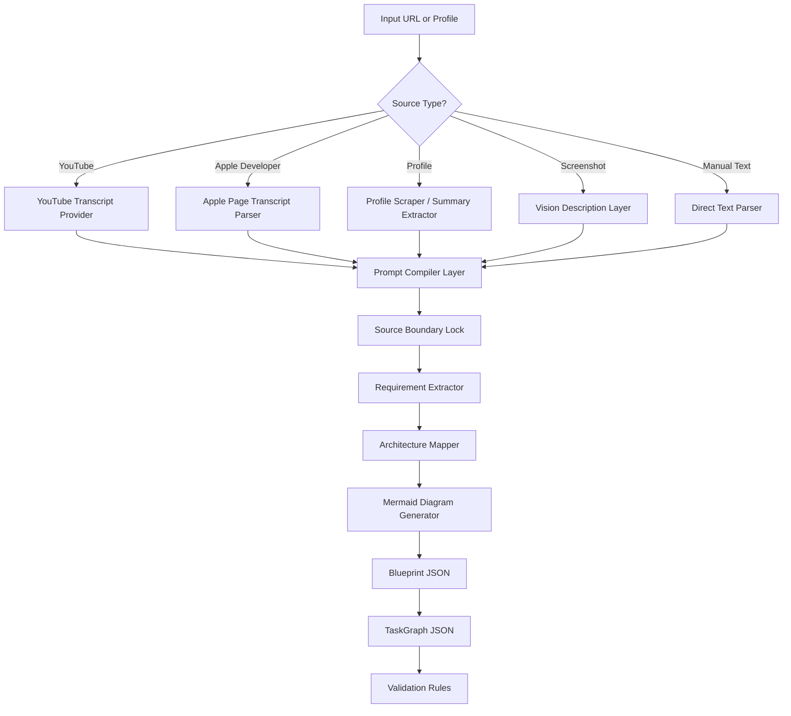

# ChatGPT Conversation Export

Generated: 2026-06-16T14:11:46Z

## Scope

This ZIP contains the current visible conversation content available in this runtime plus the attached/source files available in `/mnt/data`.

Private system/developer instructions and hidden reasoning are not included.

## Files Included

- `conversation-current-thread.md` — current thread export.
- `conversation-current-thread.json` — structured current thread export.
- `assets/image.png` — screenshot supplied in the chat.
- `assets/WWDC26 gRPC with Swift.txt` — uploaded/source transcript file available to this chat.
- `manifest.json` — file hashes and metadata.

---

# Current Thread

## User

Attached screenshot: `assets/image.png`

Link provided:

```text
https://developer.apple.com/videos/play/wwdc2026/265/
```

## Assistant

## What this is

The Apple link is **not the same topic as the screenshot’s “Generative UI with Weather” clip**. The Apple page is a WWDC26 session titled **“Build real-time apps and services with gRPC and Swift.”** It teaches how to define a gRPC service with Protocol Buffers, generate Swift client/server code, stream real-time updates, and deploy the Swift backend to the cloud. ([developer.apple.com](https://developer.apple.com/videos/play/wwdc2026/265/))

The screenshot shows a separate video/tutorial context: browser/mobile client → DNS → HTTP → backend/web app/database/cache. That is a classic “how web apps resolve and communicate with services” diagram.

## Core idea of the Apple video

The session’s flow is:



## Why this matters for **see-script-ship**

This is exactly the kind of video your platform should convert into a buildable project:



## Extracted blueprint from the video

### Project type

**Real-time Swift app + Swift backend using gRPC.**

### Confirmed features

| Feature | Description |
|---|---|
| `.proto` service contract | Defines RPCs, request messages, and response messages. |
| Generated client code | Swift app calls backend using generated gRPC client. |
| Generated server protocol | Swift backend implements generated service interface. |
| Unary RPC | `ListRaces` sends one request and receives one response. |
| Bidirectional streaming RPC | `FollowRace` lets client and server continuously exchange updates. |
| Protobuf messages | Smaller binary format than JSON, useful for mobile/network efficiency. |
| Client lifecycle manager | Reuse gRPC client instead of creating a new connection per view. |
| Cloud deployment | Package Swift server into container and deploy to a cloud service. |

Apple’s transcript states that gRPC APIs are defined through a specification, generated into code, and used for remote procedure calls rather than manually handcrafting HTTP networking code. ([developer.apple.com](https://developer.apple.com/videos/play/wwdc2026/265/))

## Buildable system version



## The skill this should become

### `video_intelligence.skill.ts`

Purpose:

> Take a video URL, profile URL, transcript, or screenshot context and convert it into a locked software blueprint.

```ts id="dwrgks"
export type VideoSourceKind =
  | "youtube"
  | "apple_developer"
  | "profile"
  | "webpage"
  | "manual_transcript"
  | "screenshot_context";

export interface VideoIntelligenceInput {
  sourceKind: VideoSourceKind;
  url?: string;
  transcript?: string;
  screenshotNotes?: string;
  userGoal: "explain" | "diagram" | "blueprint" | "build" | "compare";
  preferredOutput?: "markdown" | "json" | "mermaid" | "task_graph";
}

export interface VideoIntelligenceOutput {
  sourceSummary: string;
  confirmedFacts: string[];
  inferredIdeas: string[];
  architectureDiagram: string;
  projectBlueprint: {
    appType: string;
    frontend?: string[];
    backend?: string[];
    dataLayer?: string[];
    protocols?: string[];
    deployment?: string[];
  };
  taskGraph: Array<{
    id: string;
    title: string;
    dependsOn: string[];
    outputContract: string;
  }>;
  missingDetails: string[];
  validationChecklist: string[];
}
```

## Recommended implementation path



## Direct takeaway

This Apple video is a clean template for your system:

> **Video → transcript → protocol extraction → architecture diagram → repo scaffold → testable deployment plan.**

For **see-script-ship**, this should become a first-class provider:

```txt id="kpz39s"
/providers/video/apple-developer-provider.ts
/providers/video/youtube-provider.ts
/packages/video-intelligence
/packages/prompt-compiler
/packages/blueprint-lock
/packages/task-graph
```

The Apple session proves the value of structured contracts: `.proto` is doing for services what your **Agent Lock** should do for AI software generation.

**Same principle:**

```txt id="kdpwgr"
No vague execution.
Everything passes through a contract first.
```


## User

```text
can you zip this full convo and download it to my computer
```
